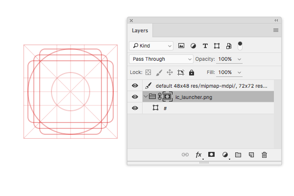

### 图标尺寸

国内多数设计师在设计 Android 应用启动图标时，并不会遵循 [Material Design 的图标规范](http://www.google.com/design/spec/style/icons.html#icons-product-icons)  ([中文版本](http://wiki.jikexueyuan.com/project/material-design/style/icons.html)，很多改了 Android 系统界面的手机公司甚至连图标尺寸都与规范不同。

下表是 Android 应用图标的标准尺寸和官方建议的命名，这些尺寸设计师应当尽量提供完整。但设计时并不需要绘制全部尺寸，而只需要按照规范中绘制 192px 的图标即可。

| 图标尺寸 (px) | 位置及命名                              | Density     |
| --------- | ---------------------------------- | ----------- |
| 48        | res/mipmap-mdpi/ic_launcher.png    | MDPI        |
| 72        | res/mipmap-hdpi/ic_launcher.png    | HDPI        |
| 96        | res/mipmap-xhdpi/ic_launcher.png   | XHDPI       |
| 144       | res/mipmap-xxhdpi/ic_launcher.png  | XXHDPI      |
| 192       | res/mipmap-xxxhdpi/ic_launcher.png | XXXHDPI     |
| 512       | res/ic_launcher-web.png            | Google Play |

---

### Adobe Generator

以前要在 Photoshop 中将内容生成多个尺寸，而不借助脚本或插件，是件非常繁琐的事情。在 Photoshop CC 2014 及之后的版本中增加了 Generator 功能，让处理这类事情变得非常简单和快速。

该功能的菜单在 "File / 文件" > "Generate / 生成" 打开 "Image Assets ／图片资源"。如果找不到该菜单，请到 "Prferences / 首选项" > "Plug-ins / 插件" > "Generator / 生成器" 对话框中，勾选 "Enable Generator" 选项以激活 Generator 功能。

基础的 Generator 用法请参考 [Photoshop Help / Generate image assets from layers](https://helpx.adobe.com/photoshop/using/generate-assets-layers.html) (中文版本，[Photoshop 帮助 / 从图层生成图像资源](https://helpx.adobe.com/cn/photoshop/using/generate-assets-layers.html))。帮助文档可能会更新不及时，若需要更详细的文档以及更高级的功能，可用参考 Generator 的 [Wiki](https://github.com/adobe-photoshop/generator-assets/wiki) 页面。

另外图标的 PSD 文档也需要针对 Generator 做以下几点优化。

1. 将图标内容的所有图层组成一个分组，命名为 "ic_launcher.png";
2. 为分组添加一个 192x192px 的矩形位图蒙板，蒙板选区的位置即是图标资源的边界区域。
3. 确保图层在缩小图像尺寸后效果不会太差。

完成以上的所有要求之后，在图标的 PSD 文档中，新建一个普通图层，将图层名修改为以下内容，这段文字定义了资源导出时的尺寸、存储路径和文件名后缀等信息。

```
default 48x48 res/mipmap-mdpi/, 72x72 res/mipmap-hdpi/,
96x96 res/mipmap-xhdpi/, 144x144 res/mipmap-xxhdpi/,
192x192 res/mipmap-xxxhdpi/, 512x512 res/-web
```

以 "default" 关键字加空格开头，后面接尺寸标识符，例如 `48x48` 或 `200%`,  随后增加一个空格紧接文件夹与文件后缀标识符，`/` 前为文件夹，`/` 后为文件名后缀，例如 `200% ios/@2x`，文件夹与文件后缀标识符为可选项，多项配置使用 `,` 或 `+` 隔开。更多的 Generator 图层命名规则，请查阅官方文档 [Generate Web Assets Functional Spec](https://github.com/adobe-photoshop/generator-assets/wiki/Generate-Web-Assets-Functional-Spec)。
{: .tips }



最后保存 PSD 文档，使用 "File / 文件" > "Generate / 生成" 打开 "Image Assets ／图片资源"。此时所有所需资源将会被存到 PSD 文档同级的 "<psd 文件名>-assets" 文件内。

此功能会实时监视 PSD 文档中图层内容，一旦内容发生变化，便会重新导出资源。如果电脑配置较低，或者文档太大，可能会卡顿的现象，所以建议平时关闭此功能，只在需要导出资源时才打开。另外当资源导出完成后资源生成完，且检查无误后，建议将资源复制到项目文件内，防止本来正确的资源被无意的修改。
