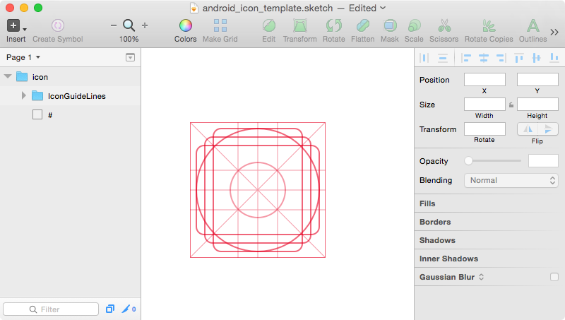
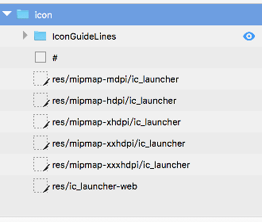
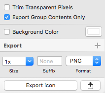

### 使用多个切片导出资源

首先你已经遵循 Material Design 设计文档中[图标规范][google_design_icon]([中文版本][google_design_icon_chinese])的要求设计了好 192x192px 的应用图标。将图标的所有图层新建分组，分组可以随意命名，在分组内增加一个 192x192px 透明或无填充无描边矩形，这个矩形作为图标导出时使用的切图边界。

建议养成在图层组或符号内，建立一个空白矩形来表示切图边界的习惯，我一般将这个图层命名为 "#"。
{: .tips }

_Android 应用启动图标模版_

此时图层结构类似上图，你可以[下载][sketch]上图的 Sketch 文件。

我用 JSON 格式表示 Android 图标尺寸及其保存路径。


[
  { "size" : 48,  "file" : "res/mipmap-mdpi/ic_launcher.png" },
  { "size" : 72,  "file" : "res/mipmap-hdpi/ic_launcher.png" },
  { "size" : 96,  "file" : "res/mipmap-xhdpi/ic_launcher.png" },
  { "size" : 144, "file" : "res/mipmap-xxhdpi/ic_launcher.png" },
  { "size" : 192, "file" : "res/mipmap-xxxhdpi/ic_launcher.png" },
  { "size" : 512, "file" : "res/ic_launcher-web.png" }
]


这个文件目前没有什么用，所以当你对代码有点反感恶心的时候，我觉得你可以打开你熟悉 Excel 记录下来。

| 切片图层命名                         | Size | Suffix | Format |
| ------------------------------ | ---- | ------ | ------ |
| res/mipmap-mdpi/ic_launcher    | 48w  |        | PNG    |
| res/mipmap-hdpi/ic_launcher    | 72w  |        | PNG    |
| res/mipmap-xhdpi/ic_launcher   | 96w  |        | PNG    |
| res/mipmap-xxhdpi/ic_launcher  | 144w |        | PNG    |
| res/mipmap-xxxhdpi/ic_launcher | 192w |        | PNG    |
| res/ic_launcher-web            | 512w |        | PNG    |

然后在图标图层组下，沿着 "#" 图层添加 6 个切片，参考上表，切片的名称分别为 JSON 中 `file` 的值去掉 `.png` 后缀。切片的设置项分别是：Size 为 JSON 中 `size` 的值后加 "w"，例如 "48w"；Suffix 留空；Format 为 "PNG"。

当可导出图层 (包括切片) 的图层名包含了路径信息，例如 `dir/dir/file`，Sketch 在导出资源时将按照路径建立文件夹。所以如果需要将同一内容导出至不同文件夹内，则可以增加多个不同命名的切片，当然嵌套可导出图层也是可行的，相比之下使用切片更容易管理。
{: .tips }

_在 Sketch 中使用多个切片导出资源。_

添加完切片后结果如上图，最后使用菜单 "File" > "Exprot ⇧⌘E" 导出图标，最终资源将会按照 Android 标准的目录结构保存。

以上已经可以满足一般设计师的需要了，如果你切片老是对不准边界，不想每次手动加 6 个切片，更改 6 组设置项 ... 或者可能你的 sketch 里有很多图标，满足以上任何情况的建议继续往下看。

---

### 使用脚本为当前选中图层添加切片

这回我要把刚才写的 JSON 用上了，选中图层分组，菜单 "Plugins" > "Custom Plugins... ⌃⇧K"，打开 "Run Custom Script" 对话框，删除示例代码，把以下的代码复制到文本框内，然后点击 "Run" 按钮。这个脚本将会自动添加切片，并且设置好切片的导出选项。把代码保存成 ".sketchplugin" 后缀的纯文本文件，就是一个 Sketch 插件。


var sliceOptions = [
    { "size" : 48,  "file" : "res/mipmap-mdpi/ic_launcher.png" },
    { "size" : 72,  "file" : "res/mipmap-hdpi/ic_launcher.png" },
    { "size" : 96,  "file" : "res/mipmap-xhdpi/ic_launcher.png" },
    { "size" : 144, "file" : "res/mipmap-xxhdpi/ic_launcher.png" },
    { "size" : 192, "file" : "res/mipmap-xxxhdpi/ic_launcher.png" },
    { "size" : 512, "file" : "res/ic_launcher-web.png" }
];
var layer = context.selection[0];
for(var i = 0; i < sliceOptions.length; i++) {
    var name = sliceOptions[i].file.substring(0, sliceOptions[i].file.lastIndexOf('.')),
        format = sliceOptions[i].file.substring(sliceOptions[i].file.lastIndexOf('.') + 1, sliceOptions[i].file.length),
        scale = sliceOptions[i].size / layer.absoluteRect().width();
    var slice = [MSSliceLayer new];
        [[slice frame] setX: 0];
        [[slice frame] setY: 0];
        [[slice frame] setWidth: layer.absoluteRect().width()];
        [[slice frame] setHeight: layer.absoluteRect().height()];
        [slice setName: name];
        [layer addSlice: slice];
    var option = [[[slice exportOptions] sizes] firstObject];
        [option setFormat: format];
        [option setScale: scale];
        [option setName: ""];
}


---

### Export Group Contents Only 选项

Sketch 中 "Slice" 和 "Exportable layer" 有一些不同，"Exportable layer" 最终导出时，每个图层或图层组内容时独立的，堆叠下方的图层不会影响上方图层的内容，"Exportable layer" 没有其他多余的选项，而默认的 "Slice" 会像 Photoshop 的切片工具一样需要隐藏堆叠下方的内容。Sketch 中 "Slice" 比提供 "Exportable layer" 更多的设置选项，如果需要像 "Exportable layer" 一样，不受堆叠下方图层的影响，需要勾选 "Export Group Contents Only" 选项，此项只有切片位于图层组内时可用。

_ 选中 "Export Group Contents Only" 选项。_

我没有查到 "Export Group Contents Only" 选项的相关代码，所以需要手动修改这个选项。

[google_design_icon]: http://www.google.com/design/spec/style/icons.html#icons-product-icons
[google_design_icon_chinese]: http://wiki.jikexueyuan.com/project/material-design/style/icons.html

[sketch]: /images/android_launcher_icon_export_use_sketch/android_icon_template.sketch
