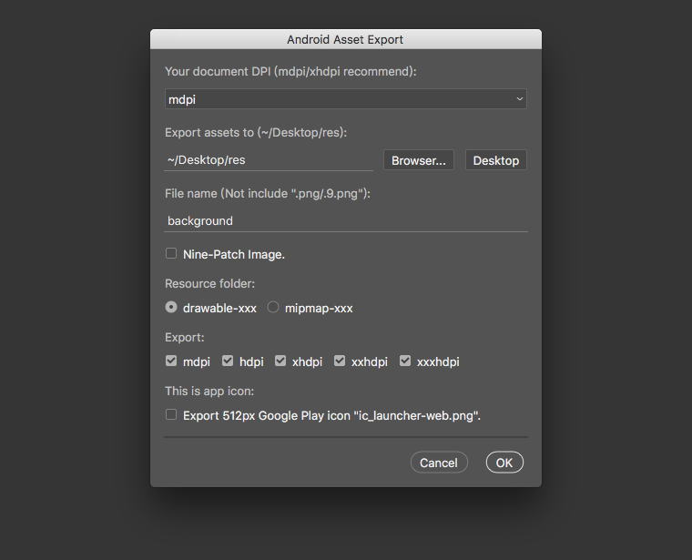

2010 年的时候，我是这样导出移动应用资源的：将内容复制到新的文档，调整画布，存储为 Web 格式，放大图像尺寸再次存储为 Web 格式。当时 iOS 只要 1x 和 2x 资源，Android 也只要 LDPI、MDPI 和 HDPI，我自己有一套动作配合快捷键来完成这一系列操作，这种方式在当时已经够用了。

2014 年初夏，我到了一家手机公司做界面设计工作，Android 应用切图成了日常工作，这时手机屏幕比以前更多了，那种重复的操作无趣而且耗时，于是决定自己动手写一些工具。

您可以在 [GUI Automation Toolbox](https://github.com/Ashung/GUI_Automation_Toolbox) 找到文章内的相关资源，但此项目已不在维护。

----

## Android Design Action

[Android_Design_Action.atn](https://github.com/Ashung/GUI_Automation_Toolbox/raw/master/Photoshop_Actions/Android_Design_Action.atn) 是一个辅助设计的动作集合。

## Android Assets Export

[Android_Assets_Export.jsx](https://github.com/Ashung/GUI_Automation_Toolbox/raw/master/Photoshop_Scripts/Android_Assets_Export.jsx) 不是那种一键导出 PSD 文档内所有资源的脚本，脚本将当前画布作为切图边界，所以您需要把要导出的内容复制到新文档， Android Design Action 内的 “Copy Layers to New Document” 动作，就是用于将选中的图层复制至到文档并自动调整画布。

运行 Photoshop 脚本可以使用这几种方法：

- 选取菜单 “File（文件）” - “Scripts（脚本）” - “Browse...（浏览）”，然后从浏览对话框中选择脚本文件打开。对于常用的脚本。可以使用动作记录这一系列操作，设置快捷键或者以按钮形式显示。
- 把脚本文件拖到应用程序区域内，macOS 系统可以拖到 dock 栏图标上。
- 把脚本文件复制到应用程序安装目录下的 "Presets/Scripts" 文件夹内，重启应用程序之后，脚本将集成至应用程序的菜单内，通常出现在菜单 "File（文件）" - "Scripts（脚本）" 内，具体位置取决于脚本本身的设置。如果脚本定义了脚本的菜单位置，不看代码的话，很难知道集成至哪个菜单内。这种方法可以为脚本设置快捷键。
- 使用 ExtendScript Toolkit 打开后，选择目标程序，点击运行按钮。这种方式适合修改，编写或调试代码，如果脚本有 log 输出，只有这张方法可以看到 log 信息。

首先将要导出的图层复制到新文档后运行脚本，此时会出现下图的对话框。



### 缩放 Nine-Patch 图片

对于 Nine-Patch 图片我使用一种特殊的缩放方法，使四边的 1px 线条在缩放之后，仍然保持 1px 并且边缘不会出现模糊。但是为了保证缩放后的 Nine-Patch 图片能够使用而且效果较好，需要在制作 Nine-Patch 图片时注意一些问题。

- 尽量避免缩小处理，建议制作 MDPI 尺寸的 Nine-Patch 图片。
- 内容区域宽高，及不透明像素的边界坐标为偶数 dp 数值，如果使用 MDPI 尺寸就是偶数的像素。
- 1px 线条位于内容区域的坐标，线条长度均保持偶数 dp 数值。


### 自定义配置

我通常使用 MDPI 尺寸设计应用界面，Android_Assets_Export.jsx 的默认选项是针对 MDPI 尺寸设计的，但脚本支持各种尺寸，而且可以灵活扩展。如果你习惯使用其他 DPI 尺寸设计界面，则可以将脚本的默认界面修改为适合你的风格。

#### 修改默认文档 DPI

使用文本编辑器打开，在代码 26 行左右的位置，将 `mdpi` 修改为你使用的尺寸，目前支持 `ldpi`、`mdpi`、`hdpi`、`xhdpi`、`xxhdpi`或`xxxhdpi`。

```javascript
// Costum dialog UI here.
// Default Photoshop document dpi.
// var psdDPI = 'mdpi'
var psdDPI = 'xhdpi';
```

#### 修改导出 DPI 列表

针对高端手机的应用，通常不需要输出 5 种 DPI 资源，可以修改代码，大概位于 28 行左右的位置，让默认导出项只有你需要的 DPI。删除数组内不需要的项即可，下一行注释表示目前支持的完整 DPI 列表。

```javascript
// DPIs you want to export by default.
var dpis = ['mdpi', 'hdpi', 'xhdpi', 'xxhdpi', 'xxxhdpi'];
// 所有支持的 DPI
// var dpis = ['nodpi', 'ldpi', 'mdpi', 'hdpi', 'tvdpi', 'xhdpi', '400dpi', 'xxhdpi', 'xxxhdpi'];
```

完整的代码托管在 github 上，如果熟悉 JavaScript 和 ExtendScript API，可以随意更改以适应自己的需求。

----

## Android Export Layers


[Android_Assets_Export.jsx](https://github.com/Ashung/GUI_Automation_Toolbox/raw/master/Photoshop_Scripts/Android_Assets_Export.jsx) 用于将 PSD 文档的图层导出至文件，同时支持不同 DPI 尺寸。

脚本默认将 PSD 文档的所有第一级图层或图层组导出至设定的文件，还可以导出选中图层组下的所有第一级图层或图层组，同时还有多种自动命名模式可以选择。这个脚本的用途很广泛，比如缩放序列动画的图片、任何相同尺寸的资源、具有公共部分的资源、样式被统一添加在父级图层组的资源等等，可以有很多自由。

首先将要导出的图层对齐层叠排列到一起，然后调整画布尺寸运行脚本。
