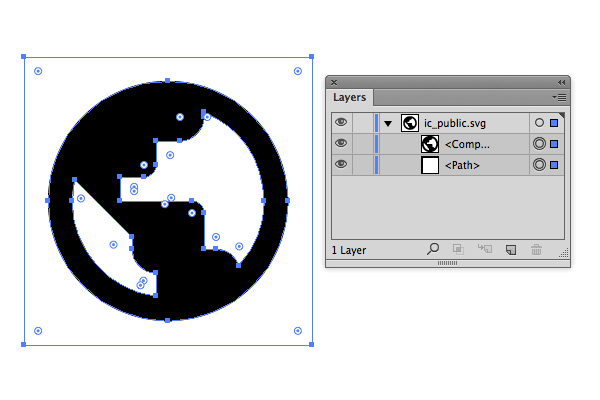
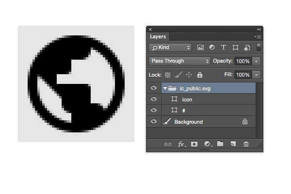
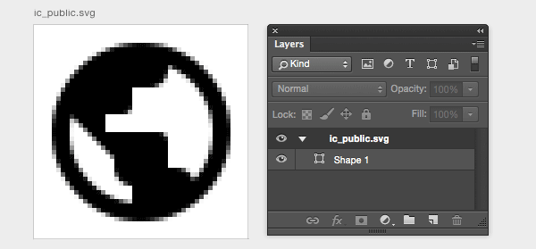
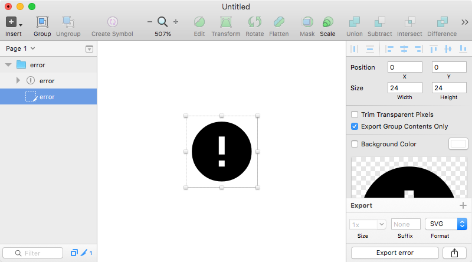

### 使用Illustrator导出SVG

我认为Illustrator是目前相对较好的SVG设计工具，在Illustrator中另存为SVG是较常用的导出SVG方法，具体如何操作网上有很多资料。你可以从查看官方帮助文档[存储图稿-以SVG格式存储](https://helpx.adobe.com/cn/illustrator/using/saving-artwork.html)，或者[Exporting SVG for the web with Adobe Illustrator CC](http://www.adobe.com/inspire/2013/09/exporting-svg-illustrator.html)。

另外在Illustrator上直接复制选中内容，粘贴至文本编辑器，也可以得到选中内容的SVG代码。我在做网页用的SVG时就经常这么做，画个矩形作为图标的边界，把图标连同矩形一起复制，然后在粘贴到文本编辑器里，再删除矩形的代码。但这对设计师来说较复杂了，也不适合批量操作，此外这种方法无法控制路径数据的精度。

还有一种方法是使用Illustrator画板导出SVG，画板大小做为图标切图区域，在另存为SVG时选择导出多个画板，建议画布命名为资源文件名。Illustrator中增加新画板对新手来说经常会忽视不齐像素，我用一个脚本把选中的图层转为画板并且自动对齐像素，最后用再另外一个脚本导出画板。如果图标很多，因为画板最多只能支持100个，这种方法还是有一些局限。你可以下载[Selection_to_Artboard.jsx][Selection_to_Artboard.jsx](用于将选择图层转为画板)和[Artboards_To_SVG.jsx][Artboards_To_SVG.jsx](用于将画板导出为SVG)这两个脚本，它们对于小项目还是适用的。

当项目较大时推荐使用[Illustrator SVG Exporter][illustrator-svg-exporter]，这是一个只有选择保存路径对话框的Illustrator脚本，用于导出文档中带".svg"后缀的路径、复合路径、组合、图层、画板等等，具体操作可见[Illustrator SVG Exporter][illustrator-svg-exporter]的项目主页。Illustrator SVG Exporter导出的SVG是沿着内容边界裁切的，所以需要在组合或图层内包含一个矩形作为切图边界，这个矩形可以是无填充的路径，最后再统一去掉这个作为切图区域矩形的代码。

_使用Illustrator SVG Exporter导出SVG时建议的图层结构_

Illustrator SVG Exporter默认导出的SVG路径数据是精确到4位小数的，对于界面使用的小图标并不需要这么精确，可以通过修改源码，将精确度改为1或2位小数。代码大概在41行位置，找到`svgOptions.coordinatePrecision = 4`，将数值改为`1`或`2`。


svgOptions.coordinatePrecision = 1;


David Deraedt的[Layer Exporter][Layer Exporter for Adobe Illustrator]是个拥有类似功能的Illustrator扩展，除了导出SVG外，还支持PNG、JPG格式，另外还提供一些简单的设置，具体使用方法可以查阅项目主页文档。

[Material design icons][Material_design_icons]的SVG也带有多余的矩形的，应该是类似的处理方法。当图标数量巨大时，需要使用编程的方法来删除SVG文件内作为切图区域矩形的多余代码，除非团队里有很多人手，否则人工操作几乎不可能。Google并没公布他们用的处理脚本。对代码恐惧，连运行代码都有难度的设计师而言，确实是很大挑战。选用画板导出方式则不需要处理这种问题，下文会介绍批量删除多余代码的方法。

##### 注意事项

* 尽量把路径描边需要扩展为填充。
* 对于同一个图标，或者图标内同类元素尽量组合成复合路径或合并路径。
* 合理的编组或者图层，一个项目内的设计内容要么是按编组划分的，要么按图层划分，不要混用两种方式。
* 注意画板的坐标尽量是整数。
* 不要用Illustrator打开SVG文件修改再保存，这样经常会导致保存后的SVG代码中viewport、path标签的数值偏移。

### Photoshop中使用Generate导出SVG

早期版本的Photoshop有一些商业的付费插件和脚本可以导出SVG，我没有用过这类工具，这里使用的是Adobe Generate的方法，具体使用方法参考[Generate Web Assets Functional Spec](https://github.com/adobe-Photoshop/generator-assets/wiki/Generate-Web-Assets-Functional-Spec)。Generator仅在Photoshop CC 14.1及以上版本上可用。Photoshop CC 2014.2及以后的版本可以单独导出单个图层组，如果要在低版本中导出单个图层组，需要将要图层组复制到新文档，再打开Generator资源生成器。

_使用Photoshop的Generate导出SVG_

我采用命名图层组，并在图层组内增加一个矩形图层作为切图的区域，矩形可以是无填充或透明的路径图层。这样导出的SVG代码同样会有多余标签，还是要面对删除多余标签的问题。

在Photoshop CC 2015可以使用画板导出SVG，将画板大小作为切图区域，这样可以不需要额外图层作为边界。

_使用Photoshop CC 2015的Artboard导出SVG_

##### 注意事项

* 尽量把路径描边需要扩展为填充。
* 对于同一个图标，或者图标内同类元素尽量放在同一个矢量图层内。
* 因为Photoshop没有矢量预览功能，所以尽量注意路径结合处的细节。
* Photoshop导出的SVG代码不可设置，而且SVG代码中元素属性被分离成CSS样式。

### Sketch导出SVG

如果使用Sketch导出SVG建议通过切片方式，并且切片不要包含在画板内(这张情况会导致SVG路径的数据是安装画板坐标生成的)。如果使用可导出图层就需要增加矩形图层作为切图边界，该图层不可以设置为无填充或者不可见，建议填充一个固定的色值。Sketch的优点是导出不需要借助复制的脚本或插件。

_使用Sketch的切片导出SVG_

Sketch导出的SVG代码冗余比较多且无法设置，而且经常增加一些奇怪的行为，如果画布中只有一个图层，Sketch会将路径的数据加在路径父级的标签上。Github上有一些清理Sketch SVG代码的工具，都没有界面的，对设计师来说又是挑战。

Github上有一些清理Sketch SVG代码的工具，都是命令行工具或某个编程语言的模块/包，而不是Sketch插件。以下列出几个排名较高的清理工具。

* [clean-sketch](https://github.com/overblog/clean-sketch)，Node.js模块。
* [gulp-clean-sketch](https://github.com/overblog/gulp-clean-sketch) ，clean-sketch的gulp插件。
* [Sketch SVG cleaner](https://github.com/Warry/SketchCleaner)， Node.js命令行工具。
* [clean-sketch-svg](https://github.com/aj0strow/clean-sketch-svg)， Ruby命令行工具。

---

### 批量删除多余代码

下载[Material design icons][Material_design_icons]项目的[master.zip][material-design-icons-master-zip]后，用Illustrator打开项目中各个分类文件夹下的"/svg/design/"目录内的SVG，你会发现这些SVG都带有一些多余的矩形，而"/svg/production/"目录内的SVG则没有这种情况。

可以使用文本编辑器打开SVG，查看其代码。在Illustrator和Photoshop中作为切图边界的无填充矩形图层，最终导出成SVG后可能会是以下几种代码。


<path d="M0 0h24v24H0z" fill="none"/>
<path fill="none" d="M0,0h24v24H0V0z"/>
<rect fill="none" width="24" height="24"/>

_Illustrator导出的SVG中作为切图边界图层的代码，版本不同可能是三种中的其中一种。_

所以在Illustrator导出的SVG中可以删除带有`fill="none"`属性的标签。

Photoshop导出的SVG会按照图层从下至上的顺序添加`class="cls-n"`属性，所以在Photoshop中把矩形图层放在图层组的最底下，可以方便确定多余图层的代码特点。所以在Photoshop使用Generate生成器导出SVG中可以删除带有`class="cls-1"`属性的标签。


<path d="M...Z" class="cls-1"/>

_Photoshop导出SVG中最底层图层的代码，将这个图层作为切图边界图层。_

找到这个规律后就可以开始编写处理SVG的代码。这里使用Node.js语言编程，需要的Node.js运行环境，最简单的安装方法就是从[Node.js官网][nodejs]下载二进制安装文件，然后一路"确定"直到安装完成。

下面的演示，使用Node.js来处理Material design icons项目的SVG文件，假设你的项目也使用类似的目录结构，为了防止处理过的SVG覆盖原始的文件，这里将处理过的SVG保存至同目录下的"/svg/production_2"文件夹内。


var fs = require("fs");
var path = require("path");

function traversal(rootDir, callback) {
    fs.readdirSync(rootDir).forEach(function(file) {
        var pathname = path.join(rootDir, file);
        if(fs.statSync(pathname).isDirectory()) {
            traversal(pathname, callback)
        } else if(fs.statSync(pathname).isFile()) {
            callback(pathname);
        }
    });
}

var designSVGDirs = [
    "action/svg/design/",
    "alert/svg/design/",
    "av/svg/design/",
    "communication/svg/design/",
    "content/svg/design/",
    "device/svg/design/",
    "editor/svg/design/",
    "file/svg/design/",
    "hardware/svg/design/",
    "image/svg/design/",
    "maps/svg/design/",
    "navigation/svg/design/",
    "notification/svg/design/",
    "places/svg/design/",
    "social/svg/design/",
    "toggle/svg/design/"
];

for(var i = 0; i < designSVGDirs.length; i ++) {
    traversal(designSVGDirs[i], function(file){
        // console.log(file);
        var productionSVGCode = fs.readFileSync(file)
            .toString()
            .replace(/<.*fill=\"none\".*\/>/g, "");
        var productionSVGDir = path.join(
                path.dirname(designSVGDirs[i]), "production_2"
            );
        if(!fs.existsSync(productionSVGDir)) {
            fs.mkdirSync(productionSVGDir);
        }
        fs.writeFileSync(
            path.join(productionSVGDir, path.basename(file)),
            productionSVGCode
        );
    });
}


保存上面的代码到Material design icons文件夹根目录，并命名为"clean.js"。

"designSVGDirs"用来记录所有的SVG文件夹，使用"clean.js"所在位置的相对路径。


var designSVGDirs = [
    "action/svg/design/",
    ...
];


处理完的SVG保存在SVG同一级的"production_2"目录，"production_2"是随意取的名字，可以随意更改。


var productionSVGDir = path.join(
    path.dirname(designSVGDirs[i]), "production_2"
);


示例的代码用来处理Illustrator导出的SVG，如果要处理Photoshop使用Generate生成器导出SVG，需要把字符串替换部分的代码按以下方式修改。


var productionSVGCode = fs.readFileSync(file)
    .toString()
    .replace(/<.*class=\"cls-1\".*\/>/g, "");


最后打开"终端"，输入以下命令来运行"clean.js"代码。


cd ~/Downloads/material-design-icons
node clean.js


---

### SVG代码优化

设计软件导出的SVG都包含各种多余的代码，这会导致文件体积较大，一般最终使用的SVG都会对SVG进行优化处理。

常用的SVG代码优化工具[SVG Optimizer][SVGO](简称SVGO)是一个[Node.js][nodejs]命令行工具。也就是说这是没有界面的，要在终端上敲代码来优化SVG，这是非常高效处理方法，但对不熟悉命令行工具的设计师来说可能会有难度，具体操作可以查阅[SVGO][SVGO]主页上的文档。

[svgomg][svgomg]是SVGO的Node.js网页应用，有很多设置项，但每次只能优化一个SVG文件，如果网页速度太慢，可以下载[源码][svgomg_source]后在本地搭建。

[svgo-gui][svgo-gui]是SVGO的跨平台界面工具，但目前已不维护，官方推荐使用命令行或网页版本。

SVGO相关的工具还有Node.js模块版本的[imagemin-svgo][imagemin-svgo]，gulp插件版本的[gulp-svgmin][gulp-svgmin]，项目主页上都有示例代码。

[SVGCleaner][SVGCleaner]另一个跨平台的带GUI界面的SVG优化软件，对命令行不熟悉的设计师可以选择这个软件。


cd ~/Downloads/material-design-icons
svgo -f action/svg/design -o action/svg/optimize


熟悉命令行工具之后，会使用发现大部分界面工具的效率并不高，建议设计师最好花点时间熟悉下命令行工具操作方式。

[nodejs]: https://nodejs.org/
[SVGCleaner]: https://github.com/RazrFalcon/SVGCleaner
[SVGCleaner-sourceforge]: http://sourceforge.net/projects/svgcleaner/
[svg-now]: https://github.com/davidderaedt/SVG-NOW
[svgo-gui]: https://github.com/svg/svgo-gui
[gulp-svgmin]: https://github.com/ben-eb/gulp-svgmin
[imagemin-svgo]: https://github.com/imagemin/imagemin-svgo
[svgomg]: https://jakearchibald.github.io/svgomg/
[svgomg_source]: https://github.com/jakearchibald/svgomg
[svg2android]: http://inloop.github.io/svg2android/
[Artboards_To_SVG.jsx]: https://github.com/Ashung/GUI_Automation_Toolbox/blob/master/Illustrator_Scripts/Selection_to_Artboard.jsx
[Selection_to_Artboard.jsx]: https://github.com/Ashung/GUI_Automation_Toolbox/blob/master/Illustrator_Scripts/Artboards_To_SVG.jsx
[illustrator-svg-exporter]: https://github.com/iconic/illustrator-svg-exporter
[Layer Exporter for Adobe Illustrator]: https://github.com/davidderaedt/Illustrator-Layer-Exporter
[Material_design_icons]: http://github.com/google/material-design-icons/
[material-design-icons-master-zip]: https://github.com/google/material-design-icons/archive/master.zip
[SketchVectorDrawable]: https://github.com/jacobmoncur/SketchVectorDrawable
[SVGO]: https://github.com/svg/svgo
