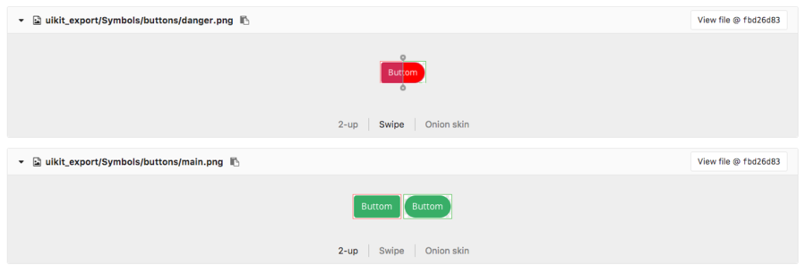
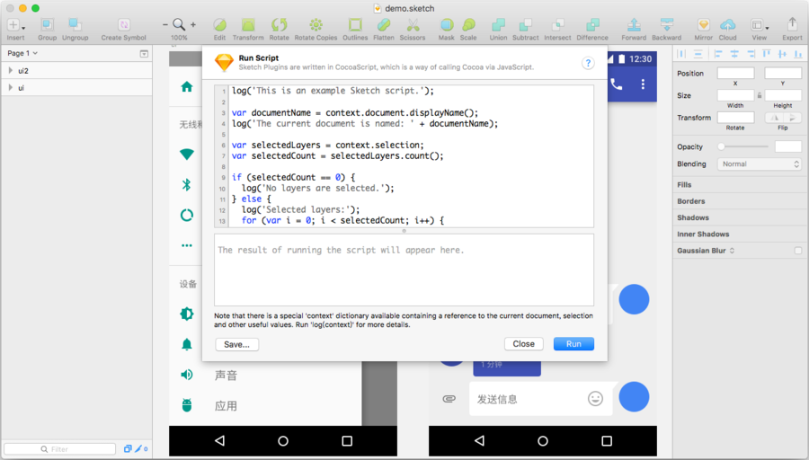

如果在你们的团队中，使用网盘、FTP、局域网共享文件夹、邮件等方式管理公共设计文档，为了记录修改历史，你可能要写一个更新记录，其实这样也难以记录下非常细节的改动。

使用 Git 管理公共设计文档，可以省去每次另存都往源文件加入数字或日期后缀的做法，由于特殊格式，依然难以直观显示记录修改。换个方式思考，我们可以用文本或图片来表示特殊格式，这样就可以被 [GitHub](https://github.com)、[GitLab](https://gitlab.com) 这样的 Web 程序或者 [SourceTree](https://www.sourcetreeapp.com) 这样的界面客户端直观的显示出来。

__GitLab 和 GitHub 对图片可以进行直观的对比。__

在 Sketch 中通常使用 Artboard 和 Symbol Master 最为一个界面或组件，所以我们只要记录这些修改。就是在 Sketch 文档完成一次迭代修改之后，提交记录到 Git 之前，我们把文档内的所有 Artboard 和 Symbol 都以预览图形式保存出来，连同 Sketch 文件一并提交到 Git 库。

能力一般的设计师可能已经无法往下看了，你们的公共文档肯定有上百甚至几百个 Symbol 。稍微对 Sketch 上点心的设计师，可能知道切换 Page，全选 Artboard，拖动图层到 Finder 就可以保存。

但对 Sketch 来说做这件事就是小菜，导出几百个 Symbol 不过一眨眼功夫。**在软件的世界里，你不须事必躬亲，不须亲力亲为。你只需要给软件下对命令。**只要做一个 Sketch 插件来处理这事就行。

----

打开一个公共的 Sketch 文档，执行菜单 “Plugins” - “Run Script...”，如果你没有升级到 Sketch 45，这个菜单，名为 “Custom Plugin...”。

你会看到这样的窗口，接下去的操作很简单，只要会打字就行，无需对这些代码心怀恐惧，在上面框内的内容全删了。



接着把下面的英文，当作打字练习打上去，把代码一字字打出来可以克服对代码的恐惧，尽量不要复制。

```javascript
var doc = context.document;
// 如果文档存在电脑中，就继续运行，新建的未保存文档将不会运行。
if (doc.fileURL()) {
    // 打算用来保存图片的文件夹路径。
    var exportPath = doc.fileURL().path().stringByDeletingPathExtension();
    log(exportPath);
}
```

然后点击右下角 “Run” 按钮，如果没错的话，下面的框会显示当前文档的路径，但是少了 “.sketch” 文件后缀。我们打算把导出的图片保存到这个和当前 Sketch 文档同名的文件夹内。

```javascript
var doc = context.document;
// 如果文档存在电脑中，就继续运行，新建的未保存文档将不会运行。
if (doc.fileURL()) {
    // 打算用来保存图片的文件夹路径。
    var exportPath = doc.fileURL().path().stringByDeletingPathExtension();
    // 遍历文档的 Page 和每个 Page 的 Artboard。
    for (var i = 0; i < doc.pages().count(); i++) {
        var page = doc.pages()[i];
        for (var j = 0; j < page.artboards().count(); j++) {
            var artboard = page.artboards()[j];
            log(page.name() + "/" + artboard.name());
        }
    }
}
```

按照上文继续修改代码，这回运行之后会列出当前文档的所有 Artboard 和所在的 Page。在 Sketch 内部 Symbol Master 继承自 Artboard，所以它也会被显示出来。

在导出图片之前，需要思考一个问题，我们把图片导出到一个与当前 Sketch 同名的文件夹内，所以必须检查下是否存在同名文件夹。另外如果修改过 Artboard 或 Symbol Master 的命名，导出后还有保留旧的图片，所以导出前要把现有文件夹删除。

接着增加删除现有文件夹的代码。

```javascript
var doc = context.document;
// 如果文档存在电脑中，就继续运行，新建的未保存文档将不会运行。
if (doc.fileURL()) {
    // 打算用来保存图片的文件夹路径。
    var exportPath = doc.fileURL().path().stringByDeletingPathExtension();
    // 删除现有文件夹。
    if (NSFileManager.defaultManager().fileExistsAtPath_(exportPath)) {
        NSFileManager.defaultManager().removeItemAtPath_error_(exportPath, nil);
    }
    // 遍历文档的 Page 和每个 Page 的 Artboard。
    for (var i = 0; i < doc.pages().count(); i++) {
        var page = doc.pages()[i];
        for (var j = 0; j < page.artboards().count(); j++) {
            var artboard = page.artboards()[j];
            log(page.name() + "/" + artboard.name());
        }
    }
}
```

功能基本上完成了，接下来最核心就是导出图片，顺便显示一个保存完成的提示。

```javascript
var doc = context.document;
// 如果文档存在电脑中，就继续运行，新建的未保存文档将不会运行。
if (doc.fileURL()) {
    // 打算用来保存图片的文件夹路径。
    var exportPath = doc.fileURL().path().stringByDeletingPathExtension();
    // 删除现有文件夹。
    if (NSFileManager.defaultManager().fileExistsAtPath_(exportPath)) {
        NSFileManager.defaultManager().removeItemAtPath_error_(exportPath, nil);
    }
    // 遍历文档的 Page 和每个 Page 的 Artboard。
    for (var i = 0; i < doc.pages().count(); i++) {
        var page = doc.pages()[i];
        for (var j = 0; j < page.artboards().count(); j++) {
            var artboard = page.artboards()[j];
            doc.saveArtboardOrSlice_toFile(artboard, exportPath + "/" + page.name() + "/" + artboard.name() + ".png");
        }
    }
    // 显示提示。
    doc.showMessage('已将 Artboard 和 Symbol 预览图保存至 "' + exportPath + '"。');
}
```

试运行一次，如果没有错误的话，点击左下角的 “Save...” 按钮，输入插件名字，插件就会出现在 “Plugins” 目录下。

----

我们把预览图按照 “page/artboard” 保存，这样可以直观查找到预览图在源文件中对应的位置，然而这样也会产生一个问题，设计师必须保证 Artboard 和 Symbol Master 在所在的 Page 下命名是唯一的。

这种方式预览图只是为了方便比较前后两次修改差异，除此之外之后并没有其他用途，如果可能会有多人同时修改同一个 Sketch 文件，还是需要事先沟通好，并且需要使用同一版本的 Sketch。

可以在 Git 库中使用 [Git LFS](https://git-lfs.github.com) 跟踪 Sketch 文件，让同步和操作更快速。LFS 在上文提到的系统中都已支持。

