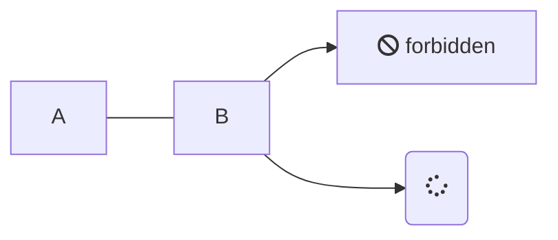

## zip 与 unzip 命令

查看 Sketch 文件内部的文件结构。

```bash
unzip -v file.sketch
```

查看或导出 Sketch 文件内部的某一文件。

```bash
unzip -p file.sketch document.json
unzip -p file.sketch document.json | python -m json.tool
```

```bash
unzip -p file.sketch document.json > document.json
unzip -p file.sketch document.json | python -m json.tool > document.json
```


Shell 解压和打包 Sketch 文件，

```shell
#!/usr/bin/env bash

sketchtool=/Applications/Sketch.app/Contents/Resources/sketchtool/bin/sketchtool

for f in "$@"
do
    # Sketch file
    if [ -f "${f}" -a ${f##*.} = "sketch" ]
    then
        folder="${f%.sketch}"
        # unzip Sketch files
        unzip -q -o "${f}" -d "${folder}"
        # export artboards
        ${sketchtool} export artboards "${f}" \
            --use-id-for-name="YES" \
            --overwriting="YES" \
            --include-symbols="YES" \
            --output="${folder}/artboards"
        # format JSON files
        cd "${folder}"
        jsons=($(find . -name "*.json"))
        for ((i=0; i<${#jsons[@]}; i++))
        do
            python -m json.tool ${jsons[$i]}  > temp && mv temp ${jsons[$i]}
        done
    fi

    # Sketch folder
    if [ -d "${f}" -a -d "${f}/pages" -a -f "${f}/user.json" -a -f "${f}/meta.json" -a -f "${f}/document.json" ]
    then
        # remove artborads folder
        if [ -d "${f}/artboards" ]
        then
            rm -rf "${f}/artboards"
        fi
        # zip
        cd "${f}"
        zip -q -r "../${f##*/}.sketch" *
    fi
done
```


git hook `pre-commit`


