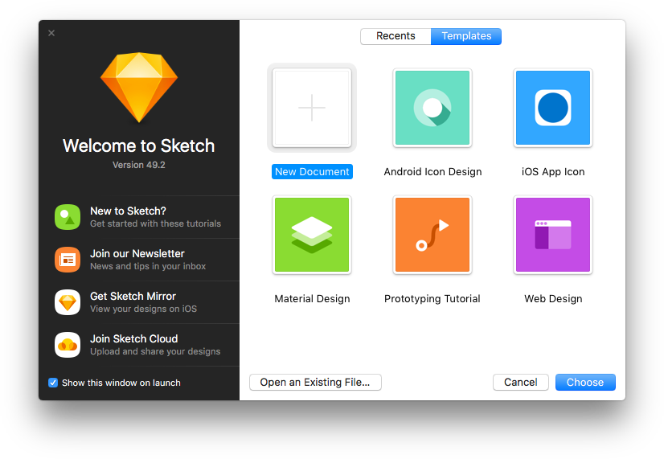
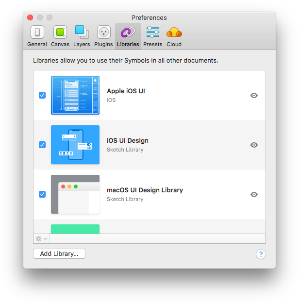
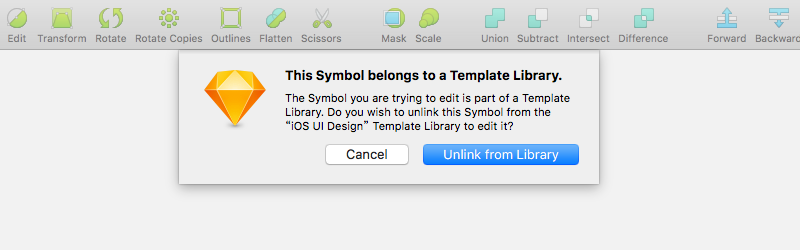
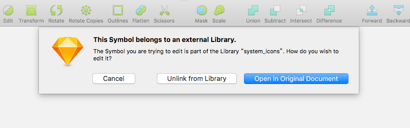
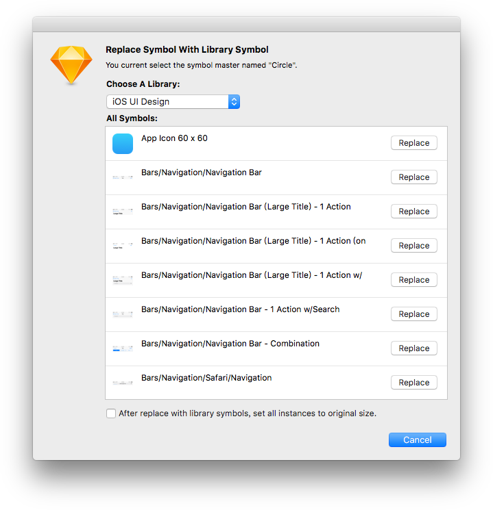
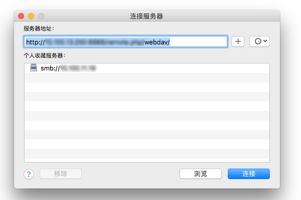
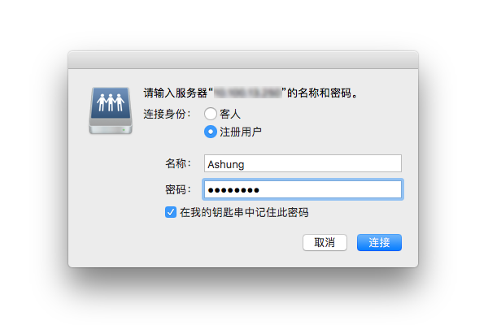
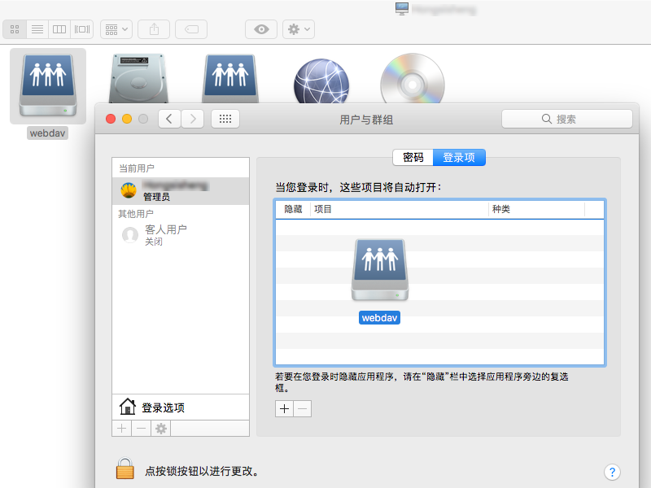

# Sketch Library 库

越来越多的设计师和团队在工作中使用 Sketch 作为主要的设计工具，得益于众多的插件和第三方应用，设计团队即使在没有技术支持的情况下也能解决一些常见问题。然而每次大版本更新并且引入激动人心功能时，也带来很多坑。最近的一次革命性更新是在 [Sketch 47](https://sketchapp.com/updates/#version-47) 引人库的功能，从[官方文档](https://sketchapp.com/docs/libraries/)和网上一些文章都可以了解到基础的教程，这篇文章主要是介绍一些没有被透露的信息，这些信息可以帮助设计团队更好的使用 Sketch，并解决一些复杂问题。

在新的版本刚发布时，我便开始在我的 [Automate](https://github.com/Ashung/Automate-Sketch) 插件中增加一些库相关的功能，久而久之便对库有了比较深入的了解。

## 基础概念

### 模版与库

[模版](https://sketchapp.com/docs/templates/)（Template）与[库](https://sketchapp.com/docs/libraries/)（Library）本质上并无区别，都是一个普通的 Sketch 文件，除了低版本（低于 43）Sketch建立的文件无法直接加入到库面板中外，任何带有组件（Symbols）的 Sketch 文件都可以直接加入库面板。

有时模版特指被加入到菜单 “New From Template” 下或显示在 Welcome 界面上的那些文件。可以使用 “Save as Template...” 菜单或者直接将文件复制到 “~/Library/Application Support/com.bohemiancoding.sketch3/Templates” 文件夹内。

库则是指被添加到 “Preferences - Libraries” 面板下的那些文件，它们没有统一保存的地方。

在没有引人库功能时，设计团队使用模版文件来协作，但 Sketch 并未提供一种文档内容更新机制，只能依赖一些插件将文档通过组件名称匹配来替换成另一个文件的组件，但这个对文档图层命名要求叫严格，也没有可视化对比。库功能解决了这种公共内容更新或替换的需求，这一点在团队协作中非常重要。

这两者并没有库会取代模版的意思，从界面上只能访问到库文档内的组件，也就是库文档内的画板（Artboard）或不在画板内的图层，对于库实际上没有太多用处的，有些库是程序生成的，这种情况组件在画布上的位置也没有太多讲究。模版文档则会带有一些实例或说明，模版内的组件也可以都替换成库的外部组件，模版也可以为库提供直观的检索、示例演示或者作为一个快速搭建界面的框架。

### 库的类型

内置库（Internal Libraries）是指随 Sketch 自带的库，目前就是 iOS UI Design 这个库，文件保存在 “/Applications/Sketch.app/Contents/Resources/libraries/iOS UI Design.sketch”，如果需要研究这个文件需要复制到其他地方再打开。

用户库（User Libraries）就是用户从库面板上的 “Add Library...” 按钮上添加的库。

在 [Sketch 49](https://sketchapp.com/updates/#version-49) 以后，增加了一种新的类型，远程库（Remote Libraries），内置的需要下载的 Apple iOS UI 也属于这个类型。目前这个功能仅开放了从 Sketch Cloud 添加库，用户需要注册 Sketch Cloud 上传文件，分享页面链接给使用者，使用者页面上的 “Download - Add Library to Sketch” 菜单添加到库面板。

这三种类型在库面板上没有明显的视觉区分，可以简单地通过右键菜单（或库面板左下角齿轮图标下拉菜单）来确认属于哪一类型。内置库无法被移除也无法打开，可以被禁用；远程库无法使用 “Show in Finder” 和 “Open ...”菜单，来自 Sketch Cloud 的远程库会有 “View in Sketch Cloud” 菜单；用户库则都有这三个菜单。

这三种库在使用上并没有非常大的差别，只是添加方式不同。来自内置库和远程库的组件，使用者无法在库中修改，双击这种组件时只有一个选项 “Unlink from Library”。

而来自用户库的组件，则有两个选项 “Unlink from Library” 和 “Open in Original Document”。可以这么理解远程库适合集中管理的库，用户无法修改而统一由管理者修改，而用户库则适合需要协作修改的库，实际上用户可以操作的只有用户库和远程库两种，下文会详细说明这两种类型的库如何同步。

### 组件实例、组件母版与库组件

组件母版（Symbol Master）是一种特殊画板，能够引出另一个分身称为组件实例（Symbol Instance），分身只有单一的图层，但可能会有不同外观。组件实例在图层面板有两种图标，旋转箭头图标表示文档内的实例，而索链图标则表示来着库的实例，因为这种来自库的实例无法在当前文档修改母版，很多情况就称为库组件（Library Symbol）。

为了区别文档上的组件母版和库组件，文档上所有的组件母版集合称为内部组件（Local Symbols），文档上所有库组件的集合通常叫外部组件（Foreign Symbols）或导入的组件（Imported Symbols）。

从插入组件的菜单上，只能显示出库文档内的所有内部组件，文档内的外部组件是不会出现在菜单上的，所以通常情况下作为库的文档都是组件母版。使用了嵌入另一库组件的库组件，如果没载入内嵌库组件所属的库，在 Overrides 中把组件更换成其他组件，就只能重新插入来恢复之前的状态。在 Sketch 49 之后，未被使用的外部组件在文档保存时会被自动删除，为了保留外部组件可以插入到画布内。

### 库组件如何从关联的库更新

在介绍库更新机制前，需要简单了解下 Sketch 内部是如何识别对象的。在 Sketch 中创建的任何对象，新建一个文件、插入一个图层、创建一个样式等等，Sketch 都会给这些对象添加唯一标识 [UUID](https://baike.baidu.com/item/UUID)。图层上的 UUID 这里称为图层 ID，组件上的 UUID 称为 组件 ID（SymbolID），组件母版和组件实例都即有图层 ID 也有 组件 ID。ID 信息在界面上没有体现，设计使也不会用到这些信息，它们是作为 Sketch 文档结构上使用的。

库组件并非真实的链接，你将包含外部组件的文档发给其他人，并不会出现坏链导致文档错误，实际上这些数据都保存在当前的文档中，所以使用外部组件不会使文档体积减小，它的优势在于更新机制。库组件也没有保存库的路径，它记录了库名、库 ID 和组件原始 ID（Remote SymbolID， 组件在它的库中的 SymbolID），库的名称显示在属性面板和外部组件管理面板上，库 ID 没有在界面上体现出来。

库组件自动更新，其实就是 “库列表” - “库 ID” - “外部组件原始 ID” 这三者的关联，通过库 ID，就是库文档的文档 ID，从库面板的列表中所有未被禁用的、链接完好的库，按照添加的时间从新到旧依次检索，直到库 ID 匹配，然后查找库文件内的与库组件 SymbolID 匹配的组件，如果内容有差异就提醒更新，更新的过程实际上就是内容替换。如果这个库文件没有与之匹配的组件，还会接着从另一个相同库 ID 的库文件内检索。如果某个环节没有结果，这个组件就不会有提示更新。比较棘手的问题是目前界面并没有地方可以处理这些关系，当这种隐藏的关系链出现问题，就需要借助特殊的插件，或通过在 “Plugins” - “Run Script...” 运行特定的脚本来查看信息或处理关联。

----

## 开始使用库

### 建立库

任何 Sketch 文件都可以当作库，对于独立的设计师的库管理者，可以比较随意的创建库，出现情况的可能性并不大。主要在于团队协作中，库管理者就需要了解上文的库类型和库组件更新原理，并且清晰这些库和组件的联系，根据自身团队的具体情况选择哪一种类型的库，用多个库文件还是一个库文件，每个库文件里有哪些内部组件。

在 Sketch 中创建组件是不可能出现重复的组件 ID 的，大部分问题出在库 ID 的管理上。从 Sketch 创建一个文档，就赋予文档一个 ID，这个在这个文档被用作库时就是库 ID，如果在 Finder 或其他非方式复制文件，就会导致库 ID 是相同的，如果直接在这个库里的组件母版修改内容，会出现相同 ID 的库里面也包含相同 ID 的组件，当这两个文件同时被加到库列表中，就会可能出现库组件关联错误或无法更新。所以确保库 ID 不重复的方法就是尽量新建文档。

### 将内部组件转为库组件

载入所有相关的库之后就可以把之前的文件转换为新的外部组件形式的文档，现在已经有成熟的插件可以处理这个艰巨的工作。

如果你之前用的是模版文件方式来设计，而且库也是原来的模版文件，那么这种情况下库内的组件 ID 和设计文档的组件 ID 是可以匹配的，可以使用基于 ID 的方式来替换。[Automate](https://github.com/Ashung/Automate-Sketch) 插件内的 “Symbol - Change Symbols to Library Symbol Base Symbol ID” 功能，在选择内部组件实例或组件母版之后，可以批量替换成制定库的相同组件 ID 的库组件。如果需要用到基于组件名称的批量替换可以使用 [Library Symbol Replacer](https://github.com/zeroheight/library-symbol-replacer) 或 [Symbol Swapper](https://github.com/sonburn/symbol-swapper)。

即非同 ID 也非同名的情况，就没法批量处理了，可以使用 [Automate](https://github.com/Ashung/Automate-Sketch) 插件内的 “Symbol - Replace Symbol with Library Symbol” 功能逐个替换。

### 库的托管方案

团队协作中，库管理者需要把库文件分发给其他设计师，设计师需要把库文件都加入库面板，有时还需要设计师配置一些基础设施，比如安装某些 Sketch 插件或者某些用于同步的工具。之后库管理者需要有一个机制来通知设计师更新库文件或自动同步。

以下列出一些从低级到高级的方案，可以根据自身团队的情况选择合适的方案。

#### 人工同步

人工同步是指利用邮件或某些传输方式，把库文件打包发给所有设计师的方法，这是一种非常低端的不推荐的方案。现实中很多国内设计团队，可能都会采用这种方案，库的管理者有个问题需要注意下，每次发文件时给文件加个版本号，最后记得抄送领导。

设计师收到带不同版本号的库文件，不需要把这些文件改成当前使用的名字，只需要直接加入库即可，旧版的文件可以从列表上删除或者禁用，这个不做也不会影响组件的更新。

#### 使用链接服务器和共享电脑同步

macOS 可以连接的服务器和共享电脑（详见[官方支持文档](https://support.apple.com/kb/PH25528?locale=zh_CN&viewlocale=zh_CN)）

有很多搭建共享磁盘的方案，。

这种同步方法没有把库文件分发给所有设计，实际上所有的设计师是从同一个共享磁盘目录载入库文件的。共享磁盘可以设置权限，这样可以避免设计师修改库文件。这种方案库文件名称必须是固定的，可以通过手动或自动备份的方法记录版本。

Windows / macOS 共享文件夹

FTP

https://support.apple.com/kb/PH25344?locale=zh_CN&viewlocale=zh_CN

WebDav

在我的钥匙串记住此密码

开机自动链接的设置。

系统便好设置 - 用户与群组 ，选择当前用户的 登录项

#### 使用云盘同步

#### 使用版本控制系统同步

#### 使用 Sketch Cloud 同步

[Elements UI Kit](https://sketchapp.com/elements) [macOS UI Library](https://sketchapp.com/libraries/mac)

https://sketch.cloud/s/VEp78

#### 自托管同步

暂未公开。

https://developer.apple.com/design/resources/

### 从库同步图层和文本样式

### 制定约束

### 

----

## 库文件维护

下文的高级话题部分会给出一些问题的解决方案，但是并非每个设计团队都有 Sketch 插件开发人员处理一些极端情况，此处列出一些库管理者应该注意的事项，可以尽量避免出现难处理的问题。

### 组件命名

### Overrides 标签命名

### 组件 ID

### 库文件性能

https://sketchapp.com/docs/other/performance/

### 在本页创建组件及组件分页

### 避免组件更新 Overrides 丢失

### 避免引入无关的外部组件

### 使用位图填充替代位图图层

### 库预览图

### 库文件拆分与合并

防止修改库

----

## 高级话题

### 修改库 ID 冲突

### 修复损坏组件

### 查找和修复坏链库组件

### 使用插件同步库

### 动态加载库
