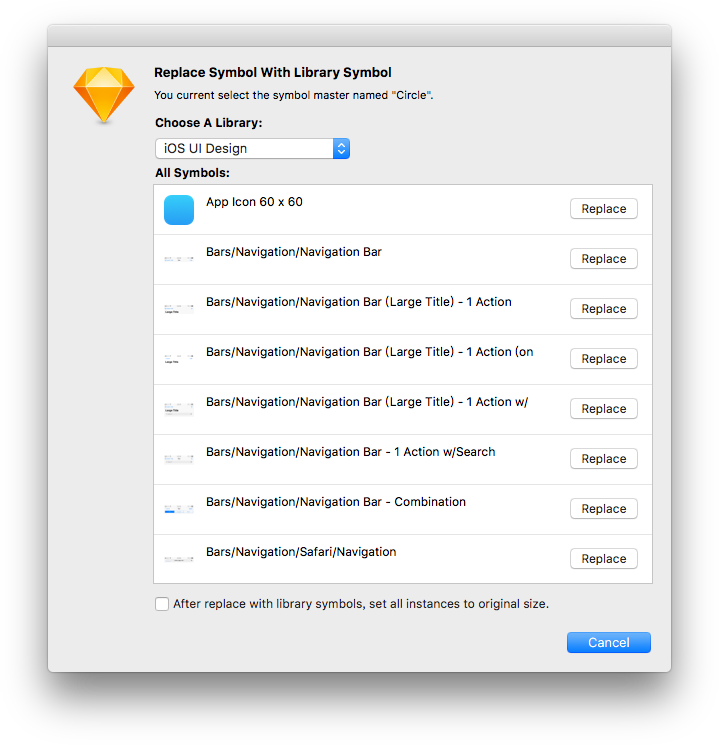
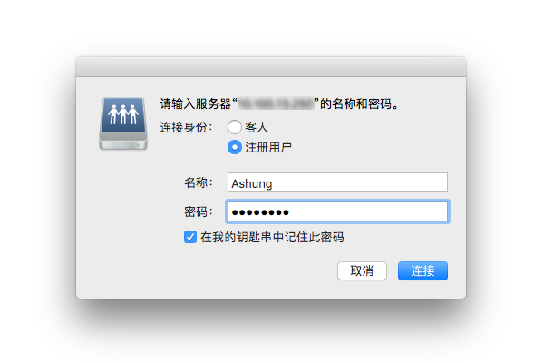

在 [Sketch 47](https://sketchapp.com/updates/#version-47) 中引人的库（Library）功能，这次更新改变了设计团队工作方式和流程。库在设计团队维护一个设计系统或风格指南上，起到非常重要的作用，可以给团队带来更加高效工作体验。

越来越多的设计师和团队使用 Sketch 作为主要的设计工具，得益于众多插件和第三方应用，即使在没有技术支持的情况下也能解决一些常见问题。然而每次引入大功能时，也会带来很多坑。事实上有些 UI 设计团队的领导，是不太注重方法和流程的，这种团队选择 Sketch 大多是为了更快速出图，在这样的团队中设计师就要艰辛地踩各种坑。

作为一个写 Sketch 插件的设计师，非常能理解这些问题给团队效率带来的影响。在 Sketch 47 刚发布时，我便开始在我的 [Automate](https://github.com/Ashung/Automate-Sketch) 插件中增加一些库相关的功能，久而久之便对库有了比较深入的了解。这篇文章主要介绍高级的信息，可以帮助设计团队更好的使用 Sketch 库，并解决一些复杂问题。如果需要基础教程，请查阅[官方文档](https://sketchapp.com/docs/libraries/)或其他网上的一些文章。

## 基础概念

### 模版与库

[**模版**](https://sketchapp.com/docs/templates/)（Template）与[**库**](https://sketchapp.com/docs/libraries/)（Library）本质上并无区别，都是一个普通的 Sketch 文件，除了低版本（低于 43）Sketch建立的文件无法直接加入到库面板中外，任何带有组件（Symbols）的 Sketch 文件都可以直接加入库面板。

有时模版特指被加入到菜单 “New From Template” 下或显示在 Welcome 界面上的那些文件。可以使用 “Save as Template...” 菜单或者直接将文件复制到 “~/Library/Application Support/com.bohemiancoding.sketch3/Templates” 文件夹内。

库则是指被添加到 “Preferences - Libraries” 面板下的那些文件，它们没有统一保存的地方。

在没有引人库功能时，设计团队使用模版文件来协作，但 Sketch 并未提供一种文档内容更新机制，只能依赖一些插件将文档通过组件名称匹配来替换成另一个文件的组件，但这对组件图层命名要求严格，也没有可视化对比。库功能解决了这种公共内容更新或替换的需求，这一点在团队协作中非常重要。

库并没有取代模版的意思，从界面上只能访问到库文档内的组件，也就是库文档内的画板（Artboard）或不在画板内的图层，对于库实际上没有太多用处的，有些库是程序生成的，这种情况组件在画布上的位置也没有太多讲究。模版文档则会带有一些实例或说明，模版内的组件也可以都替换成库的外部组件，模版也可以为库提供直观的检索、示例演示或者作为一个快速搭建界面的框架。

### 库的类型

**内置库**（Internal Libraries）是指随 Sketch 自带的库，目前就是 iOS UI Design 这个库，文件保存在 “/Applications/Sketch.app/Contents/Resources/libraries/iOS UI Design.sketch”，如果需要研究这个文件需要复制到其他地方再打开。

**用户库**（User Libraries）就是用户从库面板上的 “Add Library...” 按钮上添加的库。

在 [Sketch 49](https://sketchapp.com/updates/#version-49) 以后，增加了一种新的类型，**远程库**（Remote Libraries），内置的需要下载的 Apple iOS UI 也属于这个类型。目前这个功能仅开放了从 Sketch Cloud 添加库，用户需要注册 Sketch Cloud 上传文件，分享页面链接给使用者，使用者页面上的 “Download - Add Library to Sketch” 菜单添加到库面板。

这三种类型在库面板上没有明显的视觉区分，可以简单地通过右键菜单（或库面板左下角齿轮图标下拉菜单）来确认属于哪一类型。内置库无法被移除也无法打开，可以被禁用；远程库无法使用 “Show in Finder” 和 “Open ...”菜单，来自 Sketch Cloud 的远程库会有 “View in Sketch Cloud” 菜单；用户库则都有这三个菜单。

这三种库在使用上并没有非常大的差别，只是添加方式不同。来自内置库和远程库的组件，使用者无法在库中修改，双击这种组件时只有一个选项 “Unlink from Library”。

而来自用户库的组件，则有两个选项 “Unlink from Library” 和 “Open in Original Document”。可以这么理解远程库适合集中管理的库，用户无法修改而统一由管理者修改，而用户库则适合需要协作修改的库，实际上用户可以操作的只有用户库和远程库两种，下文会详细说明这两种类型的库如何同步。

### 组件实例、组件母版与库组件

**组件母版**（Symbol Master）是一种特殊画板，能够引出另一个分身称为**组件实例**（Symbol Instance），分身只有单一的图层，但可能会有不同外观。组件实例在图层面板有两种图标，旋转箭头图标表示文档内的实例，而索链图标则表示来着库的实例，这种来自库的实例无法在当前文档修改母版，很多情况就称为**库组件**（Library Symbol）。

为了区别文档上的组件母版和库组件，文档上所有的组件母版集合称为**内部组件**（Local Symbols），文档上所有库组件的集合通常叫**外部组件**（Foreign Symbols）或**导入的组件**（Imported Symbols）。

从插入组件的菜单上，只能显示出库文档内的所有内部组件，文档内的外部组件是不会出现在菜单上的，所以通常情况下作为库的文档都是组件母版。使用了嵌入另一库组件的库组件，如果没载入内嵌库组件所属的库，在 Overrides 中把组件更换成其他组件，就只能重新插入来恢复之前的状态。在 Sketch 49 之后，未被使用的外部组件在文档保存时会被自动删除，为了保留外部组件可以插入到画布内。

### 库组件如何从关联的库更新

在介绍库更新机制前，需要简单了解下 Sketch 内部是如何识别对象的。在 Sketch 中创建的任何对象，新建一个文件、插入一个图层、创建一个样式等等，Sketch 都会给这些对象添加唯一标识 [UUID](https://baike.baidu.com/item/UUID)。图层上的 UUID 这里称为图层 ID，组件上的 UUID 称为 组件 ID（SymbolID），组件母版和组件实例都即有图层 ID 也有 组件 ID。ID 信息在界面上没有体现，设计使也不会用到这些信息，它们是作为 Sketch 文档结构上使用的。

库组件并非真实的链接，你将包含外部组件的文档发给其他人，并不会出现坏链导致文档错误，实际上这些数据都保存在当前的文档中，所以使用外部组件不会使文档体积减小，它的优势在于更新机制。库组件也没有保存库的路径，它记录了库名、库 ID 和组件原始 ID（Remote SymbolID， 组件在它的库中的 SymbolID），库的名称显示在属性面板和外部组件管理面板上，库 ID 没有在界面上体现出来。

库组件自动更新，其实就是 “库列表” - “库 ID” - “外部组件原始 ID” 这三者的关联。通过库组件的库 ID，从库面板的列表中，按照添加的时间从新到旧依次检索所有未被禁用的、链接完好的库，直到匹配到库 ID ，然后查找该库文件内是否有与库组件 SymbolID 匹配的组件，如果包含并且内容有差异就提醒更新，更新的过程实际上就是内容替换。如果这个库文件没有与之匹配的组件，还会接着从另一个相同库 ID 的库文件内检索。如果某个环节没有结果，这个组件就不会有提示更新。比较棘手的问题是目前界面并没有地方可以处理这些关系，当这种隐藏的关系链出现问题，就需要借助特殊的插件，或通过在 “Plugins” - “Run Script...” 运行特定的脚本来查看信息或处理关联。

----

## 开始使用库

### 建立库

任何 Sketch 文件都可以当作库，对于独立的设计师的库管理者，可以比较随意的创建库，出现情况的可能性并不大。主要在于团队协作中，库管理者就需要了解上文的库类型和库组件更新原理，并且清晰这些库和组件的联系，根据自身团队的具体情况选择哪一种类型的库，用多个库文件还是一个库文件，每个库文件里有哪些内部组件。

在 Sketch 中创建组件是不可能出现重复的组件 ID 的，大部分问题出在库 ID 的管理上。从 Sketch 创建一个文档，就赋予文档一个 ID，这个在这个文档被用作库时就是库 ID，如果在 Finder 或其他非方式复制文件，就会导致库 ID 是相同的，如果直接在这个库里的组件母版修改内容，会出现相同 ID 的库里面也包含相同 ID 的组件，当这两个文件同时被加到库列表中，就会可能出现库组件关联错误或无法更新。所以确保库 ID 不重复的方法就是尽量新建文档。

### 将内部组件转为库组件

载入所有相关的库之后就可以把之前的文件转换为新的外部组件形式的文档，现在已经有成熟的插件可以处理这个艰巨的工作。

如果你之前用的是模版文件方式来设计，而且库也是原来的模版文件，那么这种情况下库内的组件 ID 和设计文档的组件 ID 是可以匹配的，可以使用基于 ID 的方式来替换。[Automate](https://github.com/Ashung/Automate-Sketch) 插件内的 “Symbol - Change Symbols to Library Symbol Base Symbol ID” 功能，在选择内部组件实例或组件母版之后，可以批量替换成制定库的相同组件 ID 的库组件。

如果需要用到基于组件名称的批量替换可以使用以下插件。

- [Library Symbol Replacer](https://github.com/zeroheight/library-symbol-replacer)
- [Symbol Swapper](https://github.com/sonburn/symbol-swapper)
- [Move to library](https://github.com/ahmedmigo/Move-to-library-sketchplugin)

即非同 ID 也非同名的情况，就没法批量处理了，可以使用 [Automate](https://github.com/Ashung/Automate-Sketch) 插件内的 “Symbol - Replace Symbol with Library Symbol” 功能逐个替换。

### 库的托管方案

团队协作中，库管理者需要把库文件分发给其他设计师，设计师需要把库文件都加入库面板，有时还需要设计师配置一些基础设施，比如安装某些 Sketch 插件、字体或者某些第三方工具。之后库管理者需要有一个机制来通知设计师更新库文件或自动同步。

以下列出一些从低级到高级的方案，可以根据自身团队的情况选择合适的方案。对库由专人管理的团队，为了防止设计师无意中修改库文件，尽量要求所有设计师关闭 Sketch 的自动保存功能。如果库需要接受多人协作，则要选择版本控制系统方案。

#### 人工同步

人工同步是指利用邮件或某些传输方式，把库文件打包发给所有设计师的方法，这是一种非常低端的不推荐的方案。现实中很多国内设计团队，可能都会采用这种方案，库的管理者有个问题需要注意下，每次发文件时给文件加个版本号，最后记得抄送领导。

上文中已经了解到组件更新机制，所以设计师收到带不同版本号的库文件，可以不把这些文件改成当前使用的名字，只需要直接加入库即可，旧版的文件可以从列表上删除或者禁用，保留在列表中也不会影响组件的更新。

#### 使用链接服务器和共享电脑同步

macOS 可以连接到一些特殊服务器和共享电脑，例如 Windows / macOS 共享文件夹、NAS 共享磁盘、FTP 和 WebDAV 等等，详细支持功能可以查看 [Apple 官方支持文档](https://support.apple.com/kb/PH25528?locale=zh_CN&viewlocale=zh_CN)。搭建这种服务的方法也比较简单，可以根据实际情况选择。

使用这种方案来同步，没有把库文件分发给所有设计，实际上所有的设计师是从同一个共享磁盘目录载入库文件的。这种方案库文件名称必须是固定的，可以通过手动或自动备份的方法记录版本。共享磁盘和 FTP 可以设置权限，这样可以避免设计师修改库文件，其他类型服务可能要考虑其他用户写入权限问题。

设计师通过 Finder 的菜单 “前往” - “链接服务器...”，挂载磁盘或链接服务器，不同类型服务的地址，请参考 [Apple 官方支持文档](https://support.apple.com/kb/PH25344?locale=zh_CN&viewlocale=zh_CN)。

要解决每次开机手动链接服务器的问题，可以设置开机自动链接。这个设置需要在链接服务器时，勾选 “在我的钥匙串记住此密码”。

然后在 “系统便好设置” - “用户与群组” ，选择当前用户的 “登录项”，并将相应的网络硬盘加入列表中并保持选中。

此方案需要注意，写入权限问题、版本管理和备份等。

#### 使用云盘同步

使用云盘同步需要考虑网络问题，是否可以文件共享，是否有客户端或系统集成的文件同步，是否有权限控制等等。如果处于保密考虑，则可能需要在内网自己搭建例如 [ownCloud](https://owncloud.org/) 的云盘程序。某些云盘服务提供 WebDAV 功能，则可以使用上一种方案。

此方案也需要注意版本管理和备份等问题。

#### 使用 Sketch Cloud 同步

在 [Sketch 49](https://sketchapp.com/updates/#version-49) 以后将 Sketch Cloud 上的文件作为库添加，库管理者将文件上传至 Sketch Cloud，然后通过开放文档或着使用邮件分享给其他设计师，设计师将文件添加到库之后，库管理者每次更新文件之后，Sketch 会自动后台下载，其他设计师就会收到更新提醒。

设计师没法修改库内容，来之云端的库文件临时存储在 “~/Library/Application Support/com.bohemiancoding.sketch3/Libraries” 目录下，临时打开可以在库面板列表右侧的 QuickLook 图标打开预览窗口，再从预览窗口右上角的 “Open With Sketch” 按钮打开。这个文件的修改会被网络的版本自动覆盖。

此方案依赖网络，并且会涉及项目的保密性，适合开放的项目，也需要注意版本管理和备份等问题。

Sketch 官方提供了两个示例文档。

- [Elements UI Kit](https://sketchapp.com/elements) [添加到库](sketch://add-library/cloud/MyY5w)
- [macOS UI Library](https://sketchapp.com/libraries/mac) [添加到库](sketch://add-library/cloud/VEp78)

#### 使用 Abstract

[Abstract](https://www.goabstract.com/) 目前仅支持 Sketch 文件的版本控制，他包装了一些 Git 版本控制系统的概念和流程，提供了一套设计师友好的文件更新记录、分支、合并等功能，采用这个方案需要所有团队成员都依赖于 Abstract 平台，并且有一套特殊的工作方式，需要付费才能开通团队协作功能，另外目前此应用不是很稳定。

类似的服务还有 [Kactus](https://kactus.io/) 和 [Plant](https://plantapp.io/)，通常都是需要付费的。

#### 使用版本控制系统同步

使用版本控制系统同步库文件，需要搭建一个版本控制系统服务器，这个有些公司的可能已经搭建好了，有些则付费使用一些在线服务。另外要求团队中的设计师要比较了解版本控制系统客户端的操作。虽然技术要求较高，但是可以很好的解决权限控制、保密性、版本管理等问题。

在小型团队或者开放的团队中，一些免费的 Git 服务也可以考虑，例如 [GitHub](https://github.com/)、[GitLab](https://gitlab.com/) 或 [BitBucket](https://bitbucket.org/)。这些对开放项目没有空间和团队限制，GitLab 和 BitBucket 的免费用户可以使用 5 人的团队，设计师使用例如 [Cornerstone](https://cornerstone.assembla.com/)（SVN）、[Versions](https://versionsapp.com/)（SVN）、[Sourcetree](https://www.sourcetreeapp.com/)（Git）、[Tower](https://www.git-tower.com/)（Git）等客户端来接收更新提醒，库管理者也使用客户端上传文件，并在 Web 端控制权限。Web 端管理程序，还附带一些文档管理、分支管理和问题跟踪等功能，有些甚至可以处理一些自动化任务。

利用 GitHub 或 GitLab 等常见的版本控制平台，通过脚本分解 Sketch 文件，按照特定的 Git Flow 工作，手工编辑 JSON 的方式也可以合并文件或解决冲突，只是对库管理者技术要求较高。

#### 自托管同步

官方工作人员称此功能尚未完善和对外开放。

目前从 [Apple UI Design Resources](https://developer.apple.com/design/resources/) 下载的 Sketch 文件就是链接至 Apple 官方自托管的库，需要从库面板下载内置的 Apple iOS UI。库更新由 Apple 官方维护，使用者可以自动接收到更新。

### 从库同步图层和文本样式

就目前的 Sketch 界面中只显示出库文档的内部组件，有些保存在库文档的资源，例如图层样式、文本样式，甚至色彩、渐变和图片填充，需要依靠插件同步至新文档。

[Automate](https://github.com/Ashung/Automate-Sketch) 插件包含从任意 Sketch 文件或库倒入文档资源和样式的功能。色彩、渐变和图片填充等文档资源是根据内容添加的不会导致列表重复，而样式则更加对象的 ID，同 ID 项的样式属性会被更新。

相关的功能如下：

- Style - Import Document Assets from Sketch File，从 Sketch 文件导入色彩、渐变及图片填充等资源。
- Style - Import Text Styles from Sketch File，从 Sketch 文件导入文本样式。
- Style - Import Layer Styles from Sketch File，从 Sketch 文件导入图层样式。
- Library - Import Document Assets from Library，从库导入色彩、渐变及图片填充等资源。
- Library - Import Styles from Library，从库导入文本和图层样式。

