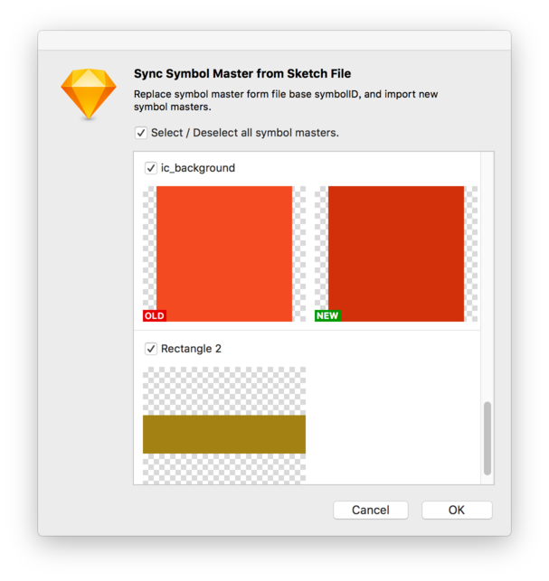

这一部分主要是针对设计团队中库管理者或设计系统维护者，介绍一些库组件命名建议、组件管理、样式管理和库文件管理方面的信息，读者只需要有这方法管理经验，不需要一些编程开发的经验。

* toc
{:toc}

## 组件命名建议

### 组件命名

库文件会分发给团队内部设计师，甚至是外部设计师，所以库组件的分组结构需要尽量清晰。组件名称使用 “/” 符号分组，建议分组在 1 - 4 之间，“/” 前后加入一个空格，名称使用 Title Case 或 lower case 方式命名，如果你的组件跟某个界面框架相应，也可以根据这个界面框架的模版名称命名。

第一组名称可以根据 Atomic Design 的理论命名。例如 Atoms、Molecules、Organisms、Templates、Pages 或 Components、Patterns 之类。第二组名称使用元素的标准名称，这个可以参考各 Web 前端框架、iOS 和 Android 等平台对控件的命名。例如 Navigation Bar、Status Bar、Toolbar。第三组名称则表示元素的不同属性或者状态，例如尺寸、浅色主题和深色主题，聚焦状态和禁用状态，正确、错误和警告状态等等。例如 Button Default、Button Primary。通常第二、三组可能会有多个子类，因为 Sketch 会以字母顺序排列，所以通常将主类的名前置，而将表示状态等词后置，这样菜单中就会显示更清晰，例如 Input / Text Disable 和 Input / Password Disable。

目前设计师可以使用 [Sketch Runner](http://sketchrunner.com/) 插件的 Insert 功能，搜索并插入所有库中的组件，但目前该插件中文搜索结果非常差，所以建议组件命名统一采用英文，并且与相应的框架或平台的规范名称一致。

如果可能会导出组件，组件命名就尽量不要包含可以用于文件名的特殊符号，和大小写敏感问题，例如 macOS 文件名不能包含 “:”，Windows 不能包含 “\\:*?<>\|” 等字符。另外在 macOS 和 Linux 中文件名以点开头的文件会被隐藏，所以组件的类中不要以点开头。

Sketch Runner 在搜索组件时，可以设置忽略名称带有某个特定前缀和后缀的组件。通常把一些不会在设计中独立使用的组件，图层命名使用 “_” 开头。 在库中那些有异议或未确定的组件，建议在图层命名结尾加 “!” 符号。 

现在有很多设计系统包含 Sketch 的 UIKit，可以从这些文件上学习他们是如果管理库组件的，最后还是要根据团队的业务、技术水平和文化等因素，结合自己的思考，制定一套适合团队的管理规范。

我的 [Design System](https://github.com/Ashung/design-systems) 插件，类似一个在 Sketch 内的浏览器书签，可以快捷的打开各个主要设计系统的主页和 Sketch 资源下载页面。

### 样式命名

图层样式和文本样式的命名，尽量根据 Web前端框架、iOS 和 Android 等平台的规范，如果自己有一套规则，也需要合理的命名。样式命名建议分组在 1 - 2 之间，可参考组件命名规则。样式的命名也可以使用 “_” 开头来表示一些不会在设计中独立使用的样式。

### Overrides 标签命名

Overrides 标签命即是组件内相应的图层名，为了能清晰表达 Overrides 中个项的含义，回出现 Overrides 面板上的图层，例如文本图层、位图图层、位图填充图层、组件实例图层和热区图层等，都尽量需要改成合理的名称，例如统一改成 Text、Image、Icon 等等之类的词汇，有些设计也使用 Emoji 加文字的方式来命名 Overrides 标签。

[Automate](https://github.com/Ashung/Automate-Sketch) 插件内 “Symbol - Rename Instances” 可以把选中的组件实例图层，改成原组件母版的最后一组名称。

----

## 组件管理

### 组件排列与分页

组件的排列，其实也就是对画板的排列。建议将同类的组件排列在一起，或者分到同一个分页内，而不要直接使用默认的水平排列方式。

[Symbol Organizer](https://github.com/sonburn/symbol-organizer) 组件管理插件，可以将组件组件按名称分组，水平或垂直排列。

[Automate](https://github.com/Ashung/Automate-Sketch) 插件内 “Arrange” 组下的很多功能，可以帮助你快速的排列各种元素，例如对换位置（Change Places Between Two Layers）、水平或垂直排列（Tile Objects by Position X/Y）、排列对象（Tile Objects）、根据位置对齐排列（Arrange Objects），这些都可以通过设置间距快速排列画板，“Tile Objects” 还加入按名称排序选项。“Order Layers By Name” 和 “Reverse Layer Order” 可以对图层列表按名称排序和反向。


组件的分页不建议使用剪切粘贴组件母版这种操作，如果一个组件可以确定没有被使用，那么同一文档内组件母版的剪切粘贴是可以的，这个操作不会导致组件 ID 改变，如果组件被使用，会导致该组件的实例变成组。从不同文档间的组件母版复制相对较安全些，如果 ID 相同新的组件母版的 Symbol ID 会被重建，如果包含内嵌的组件，则会产生相应的母版。

[Automate](https://github.com/Ashung/Automate-Sketch) 插件内 “Symbol - Move Symbol Masters to Another Page” 可以将选中的组件母版移动到指定的页面。

### 原位置创建组件母版

默认的创建组件会产生一个组件实例和组件母版，组件母版可以选择是否发送到组件分页。在库文件上直接将图层原位置变成组件母版是最强烈的需求。

不借助插件的话，可以先从图层创建画板，快捷操作是选择图层，按插入画板快捷键 “A”，从属性面板上方选择 “New from Selection” 直接从选择的图层创建画板，然后执行 “Create Symbol” 操作，这样组件母版就直接原位置。

[Automate](https://github.com/Ashung/Automate-Sketch) 插件内 “Symbol - Selection to Symbol Masters” 会将选中的图层直接原地转为组件母版，如果需要转为一个组件母版需求先组合。

### 将不独立使用的组件尺寸特殊化

Overrides 中组件的下拉菜单会显示相同尺寸的组件，如果希望让选择项中不出现其他不相关的组件，可以将某些不会独立使用的组件的尺寸特殊化，再利用组件的 Resizing 功能调整至合适尺寸。

有一种常见的示例是让一些按钮组件或图标组件支持通过 Overrides 选择项快速改变颜色，就是在图标或按钮的组件母版上，把内容图层作为蒙板，并增加一层颜色组件。色版组件采用一般组件不会出现的较小尺寸，例如 8x8 或 10x10。


在使用这种色版组件时，可以直接拉大至覆盖整个内容，巧妙的使用这种组合，可以让同一个组件快速调整内容和颜色。


### 组件更新丢失 Overrides 问题

由于组件母版内某些会出现在 Overrides 上的图层 ID 方式变化，导致用户更新组件时会丢失 Overrides 数据，此问题已在 Sketch 50 之后的版本中被解决，这个版本会因为图层名称和类型相同而导致 Overrides 数据替换时内容张冠李戴，可以通过修改不同图层名避免。旧版本请注意不要替换组件内原有的文本图层、位图图层、组件和带位图填充形状。

在 Sketch 50.x 版本上，发现修改某个嵌套在某个 Symbol Master 内的组件的 Overrides，会导致使用该 Symbol Master 的文档更新后相应的 Overrides 项被复原。所以建议养成一个习惯，不要修改 Symbol Master 内嵌套组件的 Overrides。 

----

## 样式管理

### 创建公共样式

就文本样式而言，设计规范通常会制定类似 Title、Headline、Body 之类的公共样式，在不同的场景下这些样式字体相关的设置是不变的，但可能会改变颜色，例如受应用本身的主题影响，某些文字颜色会随之改变，所以文本样式一般不考虑特殊颜色。

图层样式也有类似问题，所以通常只创建公共的部分，例如不同层次的投影、叠加效果、背景模糊效果等等。

### 保持差异和更新样式

如果采用上述的方法创建样式，使用了样式并调整过颜色的图层，就会图层样式与共享样式不匹配，属性面板上的样式名会变为斜体，并带有 “*” 号和同步图标，这时需要非常谨慎，不可以点击同步图标。

保存完整样式的好处是改一处，所有内容都一起修改，但是也会因为场景太多带来管理麻烦。而这种让图层样式与公共样式保持差异的做法，最困难的问题就是如何更新共享样式并只把部分属性同步给其他图层。

[Automate](https://github.com/Ashung/Automate-Sketch) 插件内 “Style” 组下的一些功能，可以让你先复制图层样式，再根据样式选择图层，然后将各种样式应用到图层上。


### 导入样式

[Automate](https://github.com/Ashung/Automate-Sketch) 插件包含从任意 Sketch 文件或库导入样式的功能，样式根据对象的 ID，同 ID 项的样式属性会被更新，所以这些功能在多人协作的库上，可以用来同步样式。插件样式相关的功能如下：

- Style - Import Document Assets from Sketch File，从 Sketch 文件导入色彩、渐变及图片填充等资源。
- Style - Import Text Styles from Sketch File，从 Sketch 文件导入文本样式。
- Style - Import Layer Styles from Sketch File，从 Sketch 文件导入图层样式。
- Library - Import Document Assets from Library，从库导入色彩、渐变及图片填充等资源。
- Library - Import Styles from Library，从库导入文本和图层样式。

### 清理无用样式

[Automate](https://github.com/Ashung/Automate-Sketch) 插件内的 “Style - Remove Unused Layer Styles” 和 “Remove Unused Text Styles”，会以列出为被使用样式的预览，可以在界面中选择真正无用的样式将其移除，这比在默认的样式管理面板中操作更安全。

----

## 库文件性能优化

### 控制页面内画板数量

[官方文档](https://sketchapp.com/docs/other/performance/)中提到几点文件性能优化建议，一，避免使用过多大图；二，避免使用过多模糊效果；三，避免使用过多投影；四，适当分页，避免页面内过多画板；五，避免形状图层的路径节点过多。如果整个设计系统所需要的元素都保存在一个库文件内，那就需要尽量考虑文件的性能，尤其需要控制页面内画板的数量。使用上文提到的插件和方法，可以很方便的对组件分页。

### 使用事先裁切过的图片

我观察过很多设计师在做带有很多图片的界面时，都是直接把图片拖进 Sketch，这是一个非常不好的习惯，因为拖进 Sketch 的位图还是原来的尺寸，一旦图片增加到一定量，整个文件就变得非常卡，如果在库中使用图片时，可以固定使用一张通用的图，并尽量减少图片的使用，图片需要提前裁切到最终的尺寸。

### 库文件拆分与合并

当整个设计系统的库比较庞大时，可以考虑拆分成多个文件，通常情况下 UI 元素和图标分成两个库文件，或者不同平台的 UI 元素也分拆分成多个文件。

复制粘贴就可以处理库拆分或合并，上文已经提到，新加入的组件母版如果 Symbol ID 已存在，该组件母版的 Symbol ID 会被重建，由于 Symbol ID 在界面上不可见，管理组件建议每个组件都有唯一的命名。主要是嵌套组件可能会出现重复，可以使用 [Merge duplicate symbols](https://github.com/oodesign/merge-duplicate-symbols) 插件合并同名组件。

如果整个系统被拆分成多个库组成，他们之间的组件是可以以库组件形式插入的，外部组件不会出现在插入组件菜单中，所以尽量避免插入与整个系统无关的库组件。

将一些需要导出资源的内容，例如图标、插画等，独立一个库文件是一种比较明智的做法，这样可以利用各种方式快速导出资源，而排除其他内容干扰。

### 图标库优化

[Sketch Icons](https://github.com/AMoreaux/Sketch-Icons) 插件从 SVG 文件快速创建一个可以修改颜色的 Icon 库，但这个插件只适用前期 Icon 库未被其他人使用的情况下，或者使用插件快速创建一套模版，因为每次组件创建都会赋予新的 SymbolID，导致库组件无法同步。

以往的经验几百个图标在画布中直接使用分组和使用 Symbol Master 的性能差异较大，能感受到视图移动的卡顿。所以图标数量较大时，可以考虑在工作页面画完图标，再转换为 Symbol 并发送的特定的 Symbol 页面。

如果图标已经使用 Artboard 或图层组整理好了，可以使用上文提到的 [Automate](https://github.com/Ashung/Automate-Sketch) 插件的 “Selection to Symbol Masters” 快速转为组件，再使用 [Rename It](http://rodi01.github.io/RenameIt/) 整理命名。

## 多人协作

如果文件数量多，且需要多人协作维护同一个文档，建议使用版本控制系统来管理文件，尽管原始的版本控制系统并没有提供 Sketch 文件的差异比较和合并功能，但可以通过一些脚本或插件导出 Artboard 的图片来实现直观的修改对比。

合并两个 Sketch 文件做法，类似没有出现库功能之前的做法，但不建议直接操作，因为容易造成出现多个相同内容的组件，无法直观判断导致哪个是最终使用的，合并操作可以借助插件实现。

早期的 [Automate](https://github.com/Ashung/Automate-Sketch) 插件内有 “Sync Symbol Master from Sketch File base Symbol ID” 可以实现用某一个文件的组件替换当前文档内相同 Symbol ID 的组件。这个功能的新版加入了可视化的界面，可以显示新加的组件，修改的组件可以显示类似库组件更新的前后预览图和名称对比。

   

由于插件是根据 Symbol ID 更新替换组件的，所以文件的参与修改者，需要在原组件上修改，复制组件修改会被认为是新的内容。这种替换方式只能二选一，如果需要用的双方的内容，最终的合并者可以在替换前复制备份出现冲突的组件，替换后根据需要手工修改内容。

如果组件尺寸发生变化，可能会影响某些 overrides 已设置为该组件的组件，所以建议库文件内不要修改 overrides 的内容。

## 库更新频率

官方解释目前库检测更新频率默认为 1 小时，重启 Sketch 也会让库检测更新，官方提供 [Check for Library Updates](https://github.com/bomberstudios/check-for-library-updates) 插件来手动检测更新，此功能及集成到 [Automate](https://github.com/Ashung/Automate-Sketch) 插件内的 “Library” 组下。

官方还提供一种修改隐藏设置项来强制修改检测更新频率的做法，需要在终端输入以下命名，`10` 表示 10 分钟，此处可以替换为任意整数，单位为分钟，不建议过于频繁检测更新。

```bash
defaults write com.bohemiancoding.sketch3 checkForLibraryUpdatesPeriod -int 10
```

## 库测试

### 创建模版或批量插入组件实例

使用库创建模版除了展示实际使用的示例，也可以测试其他设计师在更新库是否会发生错误。

[Symbol Instance Sheet](https://github.com/sonburn/symbol-instance-sheet) 插件可以批量插入某个库内的所有组件，特别适合图标库。

### 修改库 ID 冲突

在 Sketch 中创建组件是不可能出现重复的组件 ID 的，大部分问题出在库 ID 的管理上。从 Sketch 创建一个文档，就赋予文档一个 ID，这个在这个文档被用作库时就是库 ID，如果在 Finder 或其他非方式复制文件，就会导致库 ID 是相同的，如果直接在这个库里的组件母版修改内容，会出现相同 ID 的库里面也包含相同 ID 的组件，当这两个文件同时被加到库列表中，就会可能出现库组件关联错误或无法更新。所以确保库 ID 不重复的方法就是尽量新建文档。

对于已经重复 ID 的库，[Automate](https://github.com/Ashung/Automate-Sketch) 插件内 “Library” 组下的 “Fit Library ID Conflict”，在库面板列表包含相同 ID 库的时候，会显示所有 ID 冲突的库，然后根据情况改变库的 ID。


### 查找和修复坏链库组件

导致库组件无法更新，通常有两种情况，一是库组件关联的库在库列表中不存在或者被禁用，这种情况试图编辑组件会得到 “This Symbol belongs to an unavailable Library.” 的提示；二是虽然库组件关联的库在库列表中存在，但库中并没有相应 ID 的组件，这种情况的提示和库中存在相应 ID 的组件时的提示一样为 “This Symbol belongs to an external Library.” 或者 “This Symbol belongs to a Template Library. ”，所以这种情况从界面上非常难判断链接的库里到底有没有相应 ID 的组件。

利用 [Automate](https://github.com/Ashung/Automate-Sketch) 插件内 “Library” 组下的 “Imported Symbols Link Mange” 功能，可以看出哪一种原因导致某一个库组件无法更新，界面中以红色小字直接提示 “Library not found.”、“Library is disabled.” 和 “Symbol not found.”。该功能可以查找每个库组件的链接状态，或者针对某个库组件更改链接的库，也可以只显示库不存在的组件，在更改链接的库时，会自动检测库内是否包含与该组件相应 ID 的组件。


有一种经常遇到情况要将本来链接到一个库的所有组件修改到另一库，使用 Abstract 导出库文件的时候经常遇到这个操作，当组件数量多时使用 “Imported Symbols Link Mange” 就会有点费时，首先必须很明确要目标的库内都有相应的组件，这种情况下可以使用 [Automate](https://github.com/Ashung/Automate-Sketch) 插件内 “Library” 组下的 “Replace Library” 功能，另一个插件 [Symbol Swapper](https://github.com/sonburn/symbol-swapper) 插件内的 “Symbol Swap Libraries” 也提供类似功能。


在使用 “Imported Symbols Link Mange” 和 “Replace Library” 操作前，最好保存或备份文件，在执行操作之后可以在 Sketch 的库更新中检测是替换否正确。

## 资源导出

### 统一导出资源

例如图标或某些公共的资源，应该由一个人或者一套固定的方法统一导出资源，最终可直接用于产品上的资源需要统一的管理和质量监控，以减少团队学习时间成本和发生错误的几率。

在 [Automate](https://github.com/Ashung/Automate-Sketch) 插件内有快速添加切片并绑定导出预设的功能。“Auto Slice” 可以自定义切片尺寸，需要用户在弹出框确认信息。“Fast Slice” 则保存用户设置不再提示，直接按图层边界增加切片，并修改切片名称。但在实际的大型项目中，手动添加切片方式或者设置组件可导出的做法，效率依然非常低，在这一系列文章的下部分，会介绍使用 Sketch 脚本或插件快速导出资源的方法。

### 图片压缩和 SVG 优化

最终输出的 PNG 格式位图资源，需要保证位图的质量，除了特殊需要压缩工具尽量不要使用有损的，决定以某种有损方式保存时可以保留原版。

上文提到的可修改颜色图标库的做法，将图标主体作为蒙板增加加一个色彩组件，这种做法的组件，不会影响最终导出位图，但如果需要导出 SVG 就会让 SVG 产生多余的代码。

[Automate](https://github.com/Ashung/Automate-Sketch) 插件 “Utilities” 组下的 “Export Clean Code SVG”，可以在导出这种图层时，忽略图层组下一些例如图片、文本、组件实例等图层。在插件的 “SVG Export Setting” 中可以设置不使用图层名称作为 SVG 元素的 ID。


当导出很多图层时，选择 “Optimizion SVG Code with SVGO” （使用 SVGO 优化代码）会导致过程比较慢，建议导出未优化版，再使用 SVGO 单独优化。

----

## 附：插件推荐

#### 综合类

- [Sketch Runner](http://sketchrunner.com/) 运行插件、搜索组件、安装插件等功能
- [Automate](https://github.com/Ashung/Automate-Sketch) 插件包含多种功能
- [Sketch Select](https://github.com/canisminor1990/sketch-select) 图层选择插件
- [Rename It](http://rodi01.github.io/RenameIt/) 图层命名插件
- [Sketch Icons](https://github.com/AMoreaux/Sketch-Icons) 从 SVG 文件创建 Icon 库
- [Symbol Instance Sheet](https://github.com/sonburn/symbol-instance-sheet) 创建组件列表
- [Design System](https://github.com/Ashung/design-systems) 插件，设计系统收藏夹

#### 库和组件管理

- [Library Symbol Replacer](https://github.com/zeroheight/library-symbol-replacer)，[Move to library](https://github.com/ahmedmigo/Move-to-library-sketchplugin) 内部组件转为库组件
- [Symbol Swapper](https://github.com/sonburn/symbol-swapper) 组件替换
- [Symbol Organizer](https://github.com/sonburn/symbol-organizer) 组件管理，主要用于排列组件
- [Merge duplicate symbols](https://github.com/oodesign/merge-duplicate-symbols) 合并同名组件
- [Sketch Symbols Manager Plugin](https://gumroad.com/l/sketch-symbols-manager) 付费插件，组件命名管理

#### 样式管理

- [Sketch Style Libraries](https://github.com/sigtm/sketch-style-libraries) 从库同步样式
- [Sketch Text Styles Manager](https://gumroad.com/l/sketch-text-styles-manager) 付费插件，样式命名管理

## 附：平台控件标准名称

#### Android 

名称来源 Android Studio 3.1

**Text**: TextView, Plain Text, Password,E-mail, Phone, Postal Address, Multiline Text, Time, Date, Number, AutoCompleteTextView, MultiAutoCompleteTextView, CheckedTextView, TextInputLayout.

**Buttons**: Button, ImageButton, CheckBox, RadioGroup, RadioButton, ToggleButton, Switch, FloatingActionButton.

**Widgets**: View, ImageView, WebView, VideoView, CalendarView, ProgressBar, SeekBar, RatingBar, SearchBar, TextureView, SurfaceView, Horizontal / Vertical Divider.

**Layouts**: ConstraintLayout, Guideline, LinearLayout, FrameLayout, TableLayout, TableRow, Space.

**Containers**: Spinner, RecyclerView, ScrollView, HorizontalScrollView, NestedScrollView, ViewPager, CardView, Tabs, AppBarLayout, NavigationView, BottonNavigationView, Toolbar, TabLayout, TabItem, ViewStub.

**Google**: AdView, MapView

**Legacy**: GridLayout, ListView, TabHost, RelativeLayout, GridView.

#### iOS

名称来源 Xcode 9.2

View Controller, Navigation Controller, Table View Controller, Collection View Controller, Tab Bar Controller, Split View Controller, Page View Controller, GLKit View Controller, AVKit Player View Controller, Object, Label, Button, Segmented Control, Text Field, Slider, Switch, Activity Indicator View, Progress View, Page Control, Stepper, Horizontal Stack View, Vertical Stack View, Table View, Table View Cell, Image View, Collection View, Collection View Cell, Collection Reusable View, Text View, Scroll View, Date Picker, Picker View, Navigation Bar, Navigation Item, Toolbar, Bar Button Item, Tab Bar, Tab Bar Item, Search Bar.