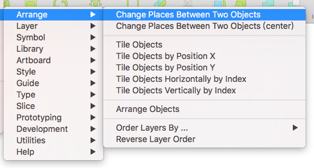
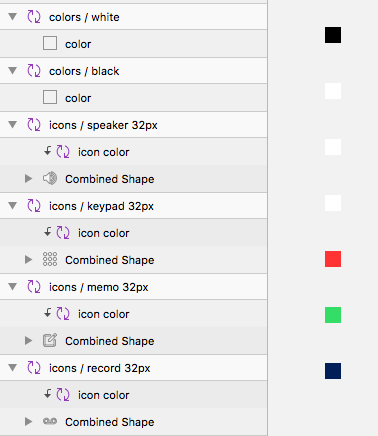
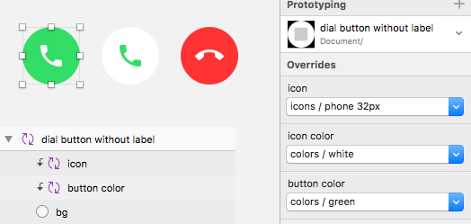

这一部分主要是针对设计团队中库管理者或设计系统维护者，介绍一些库组件命名建议、组件管理、样式管理和库文件管理方面的信息。

## 组件命名建议

### 组件命名

库文件会分发给团队内部设计师，甚至是外部设计师，所以库组件的分组结构需要尽量清晰。组件名称使用 “/” 符号分组，建议分组在 1 - 3 之间，“/” 前后加入一个空格，名称使用 Title Case 或 lower case 方式命名，如果你的组件跟某个界面框架相应，也可以根据这个界面框架的模版名称命名。

第一组名称可以根据 Atomic Design 的理论命名。例如 Atoms、Molecules、Organisms、Templates、Pages 或 Components、Patterns 之类。第二组名称使用元素的标准名称，这个可以参考各 Web 前端框架、iOS 和 Android 等平台对控件的命名。例如 Navigation Bar、Status Bar、Toolbar。第三组名称则表示元素的不同属性或者状态，例如尺寸、浅色主题和深色主题，聚焦状态和禁用状态，正确、错误和警告状态等等。例如 Button Default、Button Primary。通常第二、三组可能会有多个子类，因为 Sketch 会以字母顺序排列，所以通常将主类的名前置，而将表示状态等词后置，这样菜单中就会显示更清晰，例如 Input / Text Disable 和 Input / Password Disable。

目前设计师可以使用 [Sketch Runner](http://sketchrunner.com/) 插件的 Insert 功能，搜索并插入所有库中的组件，但目前该插件暂不支持中文，所以建议组件命名统一采用英文，并且与相应的框架或平台的规范名称一致。

如果可能会导出组件，组件命名就尽量不要包含可以用于文件名的特殊符号，和大小写敏感问题，例如 macOS 文件名不能包含 “:”，Windows 不能包含 “\\:*?<>\|” 等字符。另外在 macOS 和 Linux 中文件名以点开头的文件会被隐藏，所以组件的类中不要以点开头。

Sketch Runner 在搜索组件时，可以设置忽略名称带有某个特定前缀和后缀的组件。通常把一些不会在设计中独立使用的组件，图层命名使用 “_” 开头。 在库中那些有异议或未确定的组件，建议在图层命名结尾加 “!” 符号。 

现在有很多设计系统包含 Sketch 的 UIKit，可以从这些文件上学习他们是如果管理库组件的，最后还是要根据团队的业务、技术水平和文化等因素，结合自己的思考，制定一套适合团队的管理规范。

我的 [Design System](https://github.com/Ashung/design-systems) 插件，类似一个在 Sketch 内的浏览器书签，可以快捷的打开各个主要设计系统的主页和 Sketch 资源下载页面。

### 样式命名

图层样式和文本样式的命名，尽量根据 Web前端框架、iOS 和 Android 等平台的规范，如果自己有一套规则，也需要合理的命名。样式命名建议分组在 1 - 2 之间，可参考组件命名规则。样式的命名也可以使用 “_” 开头来表示一些不会在设计中独立使用的样式。

### Overrides 标签命名

Overrides 标签命即是组件内相应的图层名，为了能清晰表达 Overrides 中个项的含义，回出现 Overrides 面板上的图层，例如文本图层、位图图层、位图填充图层、组件实例图层和热区图层等，都尽量需要改成合理的名称，例如统一改成 Text、Image、Icon 等等之类的词汇，有些设计也使用 Emoji 加文字的方式来命名 Overrides 标签。

[Automate](https://github.com/Ashung/Automate-Sketch) 插件内 “Symbol - Rename Instances” 可以把选中的组件实例图层，改成原组件母版的最后一组名称。

----

## 组件管理

### 组件排列与分页

组件的排列，其实也就是对画板的排列。建议将同类的组件排列在一起，或者分到同一个分页内，而不要直接使用默认的水平排列方式。

[Automate](https://github.com/Ashung/Automate-Sketch) 插件内 “Arrange” 组下的很多功能，可以帮助你快速的排列各种元素，例如对换位置（Change Places Between Two Layers）、水平或垂直排列（Tile Objects by Position X/Y）、排列对象（Tile Objects）、根据位置对齐排列（Arrange Objects），这些都可以通过设置间距快速排列画板，“Tile Objects” 还加入按名称排序选项。“Order Layers By Name” 和 “Reverse Layer Order” 可以对图层列表按名称排序和反向。

组件的分页不建议使用剪切粘贴组件母版这种操作，如果一个组件可以确定没有被使用，那么同一文档内组件母版的剪切粘贴是可以的，这个操作不会导致组件 ID 改变，如果组件被使用，会导致该组件的实例变成组。从不同文档间的组件母版复制相对较安全些，如果 ID 相同新的组件母版的 Symbol ID 会被重建，如果包含内嵌的组件，则会产生相应的母版。

[Automate](https://github.com/Ashung/Automate-Sketch) 插件内 “Symbol - Move Symbol Masters to Another Page” 可以将选中的组件母版移动到指定的页面。

### 原地创建组件母版

默认的创建组件会产生一个组件实例和组件母版，组件母版可以选择是否发送到组件分页。在库文件上直接将图层原地变成组件母版是最强烈的需求。

不借助插件的话，可以先从图层创建画板，快捷操作是选择图层，按插入画板快捷键 “A”，从属性面板上方选择 “New from Selection” 直接从选择的图层创建画板，然后执行 “Create Symbol” 操作，这样组件母版就直接原位置。

[Automate](https://github.com/Ashung/Automate-Sketch) 插件内 “Symbol - Selection to Symbol Masters” 会将选中的图层直接原地转为组件母版，如果需要转为一个组件母版需求先组合。

### 色版组件的应用

有一种常见的做法，可以让一些按钮组件或图标组件快速改变颜色，就是在图标或按钮的组件母版上，把内容图层作为蒙板，并增加一层颜色组件。由于 Overrides 中组件的菜单会显示相同尺寸的组件，所以色版组件的尺寸尽量要特殊化，通常采用一般组件不会出现的小尺寸，例如 8x8 或 10x10。

在使用这种色版组件时，可以直接拉大至覆盖整个内容，巧妙的使用这种组合，可以让同一个组件快速调整内容和颜色。

### 组件更新丢失 Overrides 问题

由于组件母版内某些会出现在 Overrides 上的图层 ID 方式变化，导致用户更新组件时会丢失 Overrides 数据，此问题已在 Sketch 50 之后的版本中被解决。旧版本请注意不要替换组件内原有的文本图层、位图图层、组件和带位图填充形状。

----

## 样式管理

### 创建公共样式

就文本样式而言，设计规范通常会制定类似 Title、Headline、Body 之类的公共样式，在不同的场景下这些样式字体相关的设置是不变的，但可能会改变颜色，例如受应用本身的主题影响，某些文字颜色会随之改变，所以文本样式一般不考虑特殊颜色。

图层样式也有类似问题，所以通常只创建公共的部分，例如不同层次的投影、叠加效果、背景模糊效果等等。

### 保持差异和更新样式

如果采用上述的方法创建样式，使用了样式并调整过颜色的图层，就会图层样式与共享样式不匹配，属性面板上的样式名会变为斜体，并带有 “*” 号和同步图标，这时需要非常谨慎，不可以点击同步图标。

保存完整样式的好处是该一处，所有内容都一起修改，但是也会带来管理麻烦。而这种保存图层应用样式，并与公关样式保持差异的做法，最困难的问题就是如何更新共享样式并只把部分属性同步给其他图层。

TODO

----

## 库文件性能优化

### 控制页面内画板数量

[官方文档](https://sketchapp.com/docs/other/performance/)中提到几点文件性能优化建议，一，避免使用过多大图；二，避免使用过多模糊效果；三，避免使用过多投影；四，适当分页，避免页面内过多画板；五，避免形状图层的路径节点过多。如果整个设计系统所需要的元素都保存在一个库文件内，那就需要尽量考虑文件的性能，尤其需要控制页面内画板的数量。使用上文提到的插件和方法，可以很方便的对组件分页。

### 库文件拆分与合并

当整个设计系统的库比较庞大时，可以考虑拆分成多个文件，通常情况下 UI 元素和图标分成两个库文件，或者不同平台的 UI 元素也分拆分成多个文件。

复制粘贴就可以处理库拆分或合并，上文已经提到，新加入的组件母版如果 Symbol ID 已存在，该组件母版的 Symbol ID 会被重建，由于 Symbol ID 在界面上不可见，管理组件建议每个组件都有唯一的命名。主要是嵌套组件可能会出现重复，可以使用 [Merge duplicate symbols](https://github.com/oodesign/merge-duplicate-symbols) 插件合并同名组件。

如果整个系统被拆分成多个库组成，他们之间的组件是可以以库组件形式插入的，外部组件不会出现在插入组件菜单中，所以尽量避免插入与整个系统无关的库组件。

## 测试

### 创建模版或批量插入组件实例

### 修改库 ID 冲突

TODO

### 查找和修复坏链库组件

TODO

----

## 附：插件推荐

#### 综合类

- [Sketch Runner](http://sketchrunner.com/) 运行插件、搜索组件、安装插件等功能
- [Automate](https://github.com/Ashung/Automate-Sketch) 插件包含多种功能
- [Sketch Select](https://github.com/canisminor1990/sketch-select) 图层选择插件
- [Rename It](http://rodi01.github.io/RenameIt/) 图层命名插件
- [Sketch Icons](https://github.com/AMoreaux/Sketch-Icons) 从 SVG 文件创建 Icon 库
- [Symbol Instance Sheet](https://github.com/sonburn/symbol-instance-sheet) 创建组件列表
- [Design System](https://github.com/Ashung/design-systems) 插件，设计系统收藏夹

#### 库和组件管理

- [Library Symbol Replacer](https://github.com/zeroheight/library-symbol-replacer)，[Move to library](https://github.com/ahmedmigo/Move-to-library-sketchplugin) 内部组件转为库组件
- [Symbol Swapper](https://github.com/sonburn/symbol-swapper) 组件替换
- [Symbol Organizer](https://github.com/sonburn/symbol-organizer) 组件管理，主要用于排列组件
- [Merge duplicate symbols](https://github.com/oodesign/merge-duplicate-symbols) 合并同名组件
- [Sketch Symbols Manager Plugin](https://gumroad.com/l/sketch-symbols-manager) 付费插件，组件命名管理

#### 样式管理

- [Sketch Style Libraries](https://github.com/sigtm/sketch-style-libraries) 从库同步样式
- [Sketch Text Styles Manager](https://gumroad.com/l/sketch-text-styles-manager) 付费插件，样式命名管理

## 附：平台控件标准名称

#### Android 

#### iOS