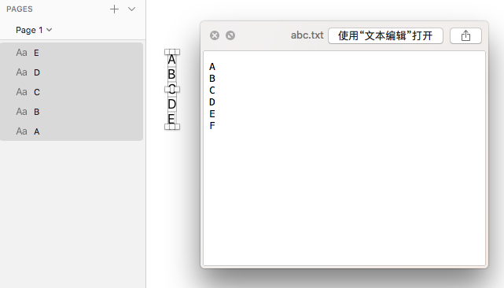

今年 6 月份就收到了 Sketch 数据填充插件的资料和内测版，于是有做了一个中文数据的插件的想法。原本计划 Sketch 52 发布时完成，但由于官方改变了一些接口和我重写了一些代码，还要调其他插件的新版兼容，结果拖到 10 月份插件差不多算完成了。

本文主要介绍使用 [Stuffing](https://github.com/Ashung/Sketch-Stuffing) 数据插件的使用，我在前文加入一些 Sketch 数据填充的基础。因为这是针对中文用户的数据插件，连界面都是中文，导致我少了美元打赏收入，因为目前为止我所有插件的人民币收入还不够买袋猫粮，所以我不会费太多笔墨介绍非常基础的东西。

* toc
{:toc}

## 数据填充基础

### 对图层插入数据

数据填充功能用于在快速插入文本或图片，目前有两种操作方式：一是选择文本或形状图层，使用工具栏 “Data” 图标或应用菜单 “Layer” - “Data” 中选择数据源；二是选择组件副本（Symbol Instance），从右侧属性面板 Overrides 下标签栏的数据图标的菜单中选择数据源。

成功对图层应用数填充后，该图层将与当前数据源绑定。绑定的好处，在于可以使用数据菜单下的 “Refresh Data / Refresh Data from Master” 或快捷键 “CMD + Shift + D” 刷新数据。使用数据菜单下的 “Clean Data” 可解除当前数据源绑定。组件内如果有图层绑定数据源，该实例标签栏的数据图标将高亮显示，同时菜单下有 “Refresh Data” 菜单。图层绑定数据后改变内容不会解除绑定，所以内容可以改为更友好的空数据状态。

### 制作数据源

Sketch 提供给初级用户简单的制作数据源方法，文本数据使用每行一个数据纯文本文件，图片数据则使用包含图片的文件夹，从 “Preferences” - “Data” 弹出框的 “Add Data...” 按钮添加。

如果使用系统自带的 “文本编辑” 编辑文本数据，必须从菜单 “格式” 下选择 “制作纯文本” ，此时软件的文字样式工具栏会隐藏，保存时选择 UTF-8 编码和 TXT 后缀。图片数据需要注意图像的尺寸不要过大，并且尽量尺寸一致，最好使用无损压缩软件优化过，保证 Sketch 文档不会因为填充图片导致体积剧增。

### 数据插件

数据源很容易在团队中制作和共享，可以让数据库管理员导出一些真实数据，也可以在网上找到类似数据。但这种方式有个局限是数据是随机的，如果需要有规律的文本，或者图文匹配就无法实现。如果需要实现此类复杂需求，就需要依靠数据插件。

数据插件很难满足各种设计业务，它更适合做成公司内部工具，例如通过内部私有的 API 接口获取真实数据、云端数据计算、搜索内部的图片素材等等。关于开发数据插件的信息，官方文章 [Do more with Data: Building a Data Supplier plugin for Sketch](https://blog.sketchapp.com/do-more-with-data-2b765e870e4f) 里有简单的介绍和示例。

------

## 使用 Stuffing 数据插件

### 随机数据

[Stuffing](https://github.com/Ashung/Sketch-Stuffing) 数据插件目前内置的随机文本类数据包括随机姓名（中文姓名、男中文姓名、女中文姓名、英文全名、男英文名、女英文名）、随机中国省市（城市、省份、省市等格式）、随机中国省市车牌号、随机常用免费邮箱地址、随机固定电话、随机移动电话、中国身份证号等。

当内置数据无法满足项目需求是，也可以从文本文件或图片文件夹随机填入数据。[List](https://github.com/listsfordesign/Lists)、[Data for Sketch](https://github.com/eyals/data-for-sketch)、[Sketch Data](https://github.com/ivomynttinen/sketch-data) 和 [Design System UI Kit Data](https://github.com/salesforce-ux/design-system-ui-kit-data) 的文本数据都可以供 Stuffing 插件使用。

### 有序数据

插件内部分自定义功能可以填充有序的文本数据，也可以从文本文件或图片文件夹填入有序数据。文本数据按照数据在文件中的行号顺序，图片文件夹使用的是 Finder 的名称排序，对应 Sketch 图层列表的顺序为从底向上。



### 关联数据

利用从文本文件或图片文件夹填入有序数据的功能，只要文本数据的顺序和图片在 Finder 的名称排序一致，就可以实现文本与图片对应的关联数据，同理也可以实现文本与文本对应，就是将一个数据表中的每个列拆分成单个文本文件。

### 日期

Stuffing 没有快速添加例如中英文月份，星期之类的数据，因为如果熟悉使用日期分类中的阳历就可以添加任何语言的日期相关数据。日期功能使用系统原生的数据，使用 [Unicode Date Format Patterns](http://www.unicode.org/reports/tr35/tr35-31/tr35-dates.html#Date_Format_Patterns) 作为数据格式，所以可以生成各种日期相关的数据。


使用时只要设置语言或地区、日期格式、起始日期和时间间隔，对于设计师来说要看懂文档并记住日期模式的语法难度比较大，下表简单列出常用的模式的中英文差异，例如日期格式 “yyyy-MM-dd eeee” 生成 “2019-02-05 星期二”。

| 名称   | 符号 | 数量 | 中文示例      | 英文示例            | 备注                                |
| ------ | ---- | ---- | ------------- | ------------------- | ----------------------------------- |
| 纪元   | G    | 1..3 | 公元          | AD                  | 1..3 表示 1 至 3 的任意值。         |
|        |      | 4    | 公元          | Anno Domini         |                                     |
|        |      | 5    | 公元          | A                   |                                     |
| 年     | Y    | 1..n | 2019          | 2019                | 也可使用 y，YY 表示年份后 2 位数。  |
| 季度   | Q    | 1    | 1             | 1                   | 也可使用 q。                        |
|        |      | 2    | 01            | 01                  |                                     |
|        |      | 3    | 1季度         | Q1                  |                                     |
|        |      | 4    | 第一季度      | 1st quarter         |                                     |
| 月     | M    | 1    | 1             | 1                   | 在农历时 M 生成 一、二 ...。        |
|        |      | 2    | 01            | 01                  |                                     |
|        |      | 3    | 1月           | Jan                 |                                     |
|        |      | 4    | 一月          | January             |                                     |
|        |      | 5    | 1             | J                   |                                     |
| 周     | E    | 1    | 1             | 1                   |                                     |
|        |      | 2    | 01            | 01                  |                                     |
|        |      | 3    | 周日          | Sun                 |                                     |
|        |      | 4    | 星期日        | Sunday              |                                     |
|        |      | 5    | 日            | S                   |                                     |
|        |      | 6    | 周日          | Su                  |                                     |
| 日     | d    | 1..2 | 1             | 1                   | 两位表示不足两位时补零。            |
|        | D    | 1..3 | 1             | 1                   | 一年中第几日。                      |
| 上下午 | a    | 1    | 上午          | AM                  |                                     |
| 时     | h    | 1..2 | 1             | 1                   | 12 小时制，两位表示不足两位时补零。 |
|        | H    | 1..2 | 13            | 13                  | 24 小时制，两位表示不足两位时补零。 |
| 分     | m    | 1..2 | 0             | 0                   | 两位表示不足两位时补零。            |
| 秒     | s    | 1..2 | 0             | 0                   | 两位表示不足两位时补零。            |
| 时区   | z    | 1..3 | GMT+8         | GMT+8               |                                     |
|        |      | 4    | 中国标准时间  | China Standard Time |                                     |
|        | Z    | 1..3 | +0800         | +0800               |                                     |
|        |      | 4    | GMT+08:00     | GMT+08:00           |                                     |
|        |      | 5    | +08:00        | +08:00              |                                     |
|        | v    | 1    | 中国时间      | China Time          |                                     |
|        |      | 4    | 中国标准时间  | China Standard Time |                                     |
|        | V    | 1    | cnsha         | cnsha               |                                     |
|        |      | 2    | Asia/Shanghai | Asia/Shanghai       |                                     |
|        |      | 3    | 上海          | Shanghai            |                                     |
|        |      | 4    | 中国时间      | China Time          |                                     |

农历日期中不采用跟阳历相同的模式替换，而是直接字符替换，日期格式中 "U" 表示干支纪年，"Z" 表示生肖，"M" 表示月，"D" 表示日，例如 2019 年 2 月 5 日，日期格式为 “U年 (Z年) M 月 D” 会生成 “乙亥年 (猪年) 正月初一”。


### 时间

友好时间格式随机时间在起始时间和结束时间之间，生成几段随机时间，在套用选择的常见友好时间格式，可以用在信息或文章的发布时间上。


自定义格式随机时间会在起始时间和结束时间之间生成几段随机时间，在对时间使用 [Unicode Date Format Patterns](http://www.unicode.org/reports/tr35/tr35-31/tr35-dates.html#Date_Format_Patterns) 格式化，可以用在某些数据的具体时间上。


### 自定义编号

自定义编号是一种以一些可用字符随机去替换制定格式种的某个指定字符，用来生成任何固定长度的随机号码。内置了几种常见格式，包括 4 位数字验证码、4 个数字字母混合验证码、13 位数字快递单号、MAC 地址、MD5、 SHA-1 和 UUID。


例如需要随机生成中国护照号码，可用字符使用 “0123456789”，格式为 “EXXXXXXXX”，替换字符为 “X”，生成编号类似 “E51492895”。

### 自定义序列数值

自定义序列数值用来生成包含递增或递减的数字的序列，可增加前缀及后缀，类似数字编号、相机照片文件名等等。


### 自定义表达式

自定义表达式是 Stuffing 中较复杂的功能，通过 JavaScript 语句生成字符串生成数值或字符串，在表达式中可以使用一些预留的变量，例如数组 "data" 、整型图层索引 "i"、 "length" 图层数、"layer" 当前图层、"text" 当前图层文本内容等。由于该功能会直接执行用户输入的代码，如果用户不熟悉 JavaScript 或者输入错误可能无法生成数据，甚至导致 Sketch 奔溃。以下列举一些常用示例。


可以对 "text" 当前图层文本内容做任何 JavaScript 的字符串操作，例如在文本前加入有序列表序号。

```javascript
(i + 1) + ", " + text
```

数组 "data" 保存前几次遍历时表达式返回的所有字符串结果，例如可以用来生成斐波那契数列。

```javascript
(i < 2) ? 1 : Number(data[i-1]) + Number(data[i-2])
```

变量 "layer" 为当前图层，例如用来生成图层坐标。

```javascript
"(" + layer.frame().x() + "," + layer.frame().y() + ")"
```

生成及格率为 80% 的成绩。

```javascript
Math.random() < 0.8 ? Math.floor(Math.random() * (41)) + 60 : Math.floor(Math.random() * 59)
```

随机拼成 50 个 0 或 1 字符。

```javascript
var t = ""; for(var j = 0; j < 50; j++) { t += Math.floor(Math.random() * 2) } t
```

对于熟悉 JavaScript 的用户自定义表达式功能可以实现很多种类的随机数据。
