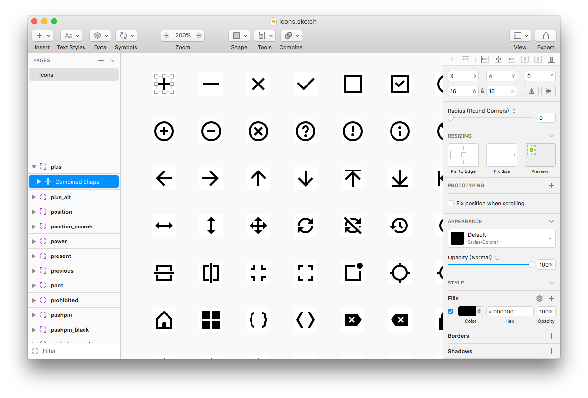
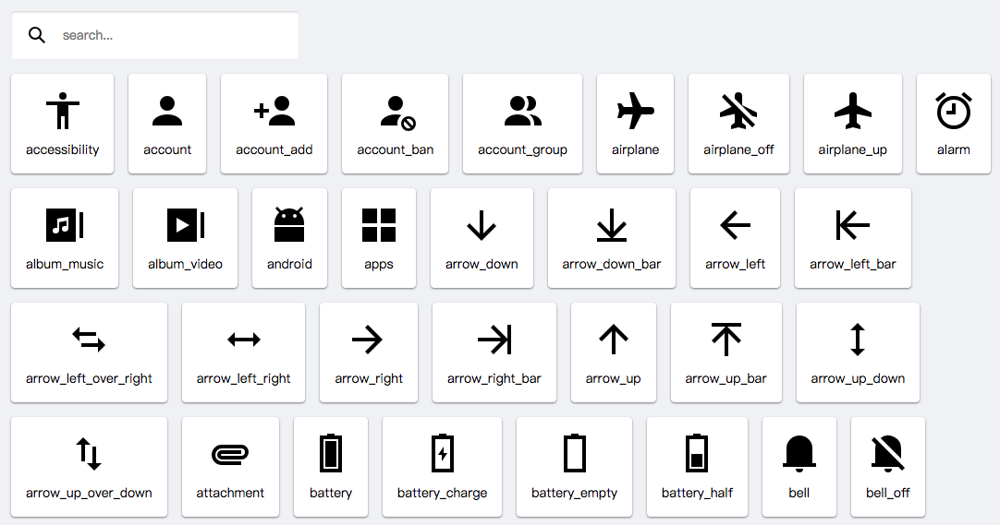
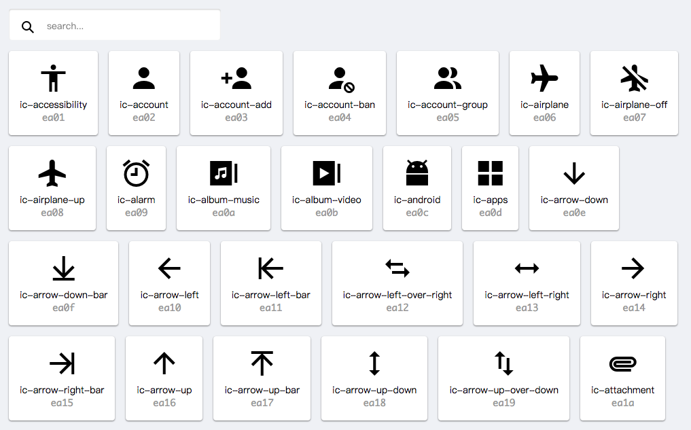

本文主要介绍如何利用开源的 gulp 插件或 node.js 模块从 Sketch 文件输出资源，希望能让工程师与设计师更好地协作。现在的程序开发资源不像以往只是简单的图片，很多 Web 前端 UI 框架使用 icon font，设计师虽然可以使用 iconfont.cn，icomoon.io 这类网站管理和输出资源，但效率不高。

文中会尽量囊括目前各种应用场景的资源，包括多分辨率 PNG，iOS 和 macOS 平台的 PDF，Web 的图标字体、SVG Sprite 或 SVG symbol，Android 平台的 Vector Drawable 等等。读者需要了解基础的命令行操作，以及基础的 gulp 和 node.js 编程，由于使用 Sketch 自带的命令行工具 sketchtool，所有依赖此工具的都必须在安装有 Sketch 的 macOS 上运行。

* toc
{:toc}
## 项目源码

文章中的所有代码及 Sketch 文档都保存在 [Sketch Export Master](https://github.com/Ashung/sketch-export-master) 项目中，为了文章的篇幅简洁部分非主要代码会省略，可以到项目的 GitHub 上查看完整代码。

## Sketch 文件规范

在现实中需要使用快速导出资源并转换多种格式操作的，大部分都是处理一些数量较多的系列图标或者插图等，文章中会以图标作为示例。为了方便程序准确的读取 Sketch 文件的信息，需要让设计师在设计图标时遵循一些规范，根据当前 Sketch 的功能，我使用如下的规范。Sketch 文件可以在 [Sketch Export Master](https://github.com/Ashung/sketch-export-master) 项目中找到。

每一个图标都是一个 Symbol Master，这样做 Sketch 文件可以被当作库来使用。可以先创建 Artboard 再将其转为 Symbol，就可以在原位置创建 Symbol 而不会产生一个 Symbol 实例，如果已经使用组来分类每个图标，可以使用 [Automate](https://github.com/Ashung/Automate-Sketch) 插件内 “Symbol - Selection to Symbol Masters” 功能直接转为 Symbol Master。

在 Sketch 52.x 中 Symbol 实例可以更改 style overrides，所以为每个图标绑定一个类似 “Colors/Default” 的黑色样式是个不错的做法。当然图标也可以是彩色或者包含透明度的，但你必须清楚了解某些类型资源本身的限制，例如目前图标字体只会是单色。

尽量将图标的图层都合并到一个形状图层上，特别是需要输出代码形式的资源，这样可以得到更少的代码。如果需要导出 Android 平台的 Vector Drawable，建议把形状图层填充选项设置为 Non-Zero，在 Sketch 52.x 中此设置包含在样式中，所以默认样式要包含此设置。另外一些特殊功能蒙板、投影样式等，某些代码类型的资源可能不支持，需要仔细了解各自的限制。

资源的命名上，为了避免多余整理命名操作，不建议使用 Sketch 的分组符号 “/”，而是用小写英文和分隔符（“-” 或 “\_”）的组合。示例中使用 Sketch 组件命名使用 “\_” 分隔符。

图标尺寸使用图标原始的尺寸，例如统一使用 24x24px。 



## 安装 gulp 和配置项目

先升级或安装 node.js 到最近的版本，安装 gulp 命令行工具，这里使用 gulp-cli 2.0.1 和 gulp 4.0.0。

```bash
sudo npm install --g gulp-cli
```

你可以使用下面命令，从 [Sketch Export Master](https://github.com/Ashung/sketch-export-master) 项目上克隆代码，这样会得到一个完整功能的 gulpfile.js，这时可以忽略下文的安装 gulp 插件和 node.js 模块。

``` bash
git clone https://github.com/Ashung/sketch-export-master.git
cd sketch-export-master
npm install
```

如果你不需要所有功能，也可以初始化一个新的项目，并安装最新版的 gulp。

```bash
cd icon_project
npm init
npm install --save-dev gulp
```

这种情况就需要安装输出不同资源所需要 gulp 插件或 node.js 模块。这里使用 [del](https://www.npmjs.com/package/del) 在生成资源前删除旧的资源，避免因 Sketch 文件图层名修改造成资源冗余。使用 [gulp-imagemin](https://github.com/sindresorhus/gulp-imagemin) 压缩 PNG 和 SVG 资源。 [child-process-promise](https://www.npmjs.com/package/child-process-promise) 用来运行命令从 Sketch 文件导出最初的资源。这几个是必须的。

```bash
npm install --save-dev del child-process-promise gulp-imagemin
```

项目的目录结构如下，sketch 文件夹用来保存设计源文件。

```
icon_project/
	|-- node_modules/
	|-- sketch/
		|-- icons.sketch
	|-- gulpfile.js
	|-- package.json
	|-- package-lock.json
```

## 在 gulp 中使用 sketchtool

文中没有使用 [gulp-sketch](https://www.npmjs.com/package/gulp-sketch)，是因为 sketchtool 附在 Sketch 安装文件内，经常更新而且需要 sketchtool 和 Sketch 的版本相匹配，所以这里直接使用 [child-process-promise](https://www.npmjs.com/package/child-process-promise) 运行 sketchtool 命令是比较合适的选择。sketchtool 可以使用命名导出 Sketch 支持的各种格式，详细的用法请参考[官方文档](https://developer.sketchapp.com/guides/sketchtool/)。

以下是 “gulpfile.js” 公共部分。

```javascript
const gulp = require('gulp');
const del = require('del');
const exec = require('child-process-promise').exec;

const imagemin = require('gulp-imagemin');

let sketchtool = '/Applications/Sketch.app/Contents/Resources/sketchtool/bin/sketchtool';
let sketchFile = './sketch/icons.sketch';
```

为了让 `gulp --tasks` 或其他程序只列出可用的独立任务，采用了以下的编码方式。

单个任务，运行 `gulp task1`。

```javascript
const gulp = require('gulp');

function task() { ... }
task.displayName = 'task1';
task.description = 'task description';

gulp.task(task);
```

多个系列任务，运行 `gulp task1`。很多情况下会使用这种方式，导出一种资源通常需要删除旧数据，导出资源和优化资源等 3 个子任务。

```javascript
const gulp = require('gulp');

function subtask1() { ... }
subtask1.displayName = 'subtask 1';

function subtask2() { ... }
subtask2.displayName = 'subtask 2';

let task = gulp.series(subtask1, subtask2);
task.description = 'task 1';

gulp.task('task1', task);
```

这种编码习惯，在运行  `gulp --tasks` 时可以清晰列出 task 名和描述，及其依赖的子任务。

```bash
gulp --tasks

[14:32:08] Tasks for ~/Works/icon_project/gulpfile.js
[14:32:08] └─┬ PNG 1x  Export 1x Optimized PNG
[14:32:08]   └─┬ <series>
[14:32:08]     ├── Clean 1x PNG
[14:32:08]     ├── Export 1x PNG
[14:32:08]     └── Optimize 1x PNG
```

在运行任务过程中也能清晰看到当前执行的任务。

```
gulp "PNG 1x"

[14:33:24] Using gulpfile ~/Works/icon_project/gulpfile.js
[14:33:24] Starting 'PNG 1x'...
[14:33:24] Starting 'Clean 1x PNG'...
[14:33:24] Finished 'Clean 1x PNG' after 9.57 ms
[14:33:24] Starting 'Export 1x PNG'...
[14:33:25] Finished 'Export 1x PNG' after 614 ms
[14:33:25] Starting 'Optimize 1x PNG'...
[14:33:26] gulp-imagemin: Minified 83 images (saved 3.05 kB - 12.7%)
[14:33:26] Finished 'Optimize 1x PNG' after 971 ms
[14:33:26] Finished 'PNG 1x' after 1.6 s
```

## 资源文件名修改

sketchtool 会在导出放大的资源时自动增加 “@nx” 后缀，其他平台并不需要这种多余后缀，还有 Android 平台需要把不同分辨率保存在不同文件夹内，还有在整个示例中输出的文件名统一使用  “\_” 分隔符，文件夹名使用 “-” 分隔符， SVG 或 CSS 代码中的 id 或 class 也使用 “-” 分隔符。在项目中使用 [gulp-rename](https://www.npmjs.com/package/gulp-rename) 来重命名文件和更改目录，可以不需要增加一个子任务函数来处理名称，把代码加在某个任务的 `pipe` 内。gulp-rename 的重命名文件是对文件的复制，所以还需要删除旧的文件。

```bash
npm install --save-dev gulp-rename
```

统一文件名分隔符。

```javascript
function subtask1() {
    return gulp.src('...')
    	.pipe(rename((path, file) => {
            path.basename = path.basename.replace(/(-|\s+)/g, '_'); // 将 - 或空格都替换为 _
            del(file.path);
        })
    	.pipe(gulp.dest('...'));
}
```

删除或替换后缀。

```javascript
path.basename = path.basename.replace(/@\dx$/, ''); // 删除后缀
path.basename = path.basename.replace(/@(\d)x$/, '_$1x'); // 替换后缀
```

## 处理多个 Sketch 文件

文中的示例都只是处理一个 Sketch 文件，如果需要从多个文件导出资源可以参考下面的方式。

```javascript
function subtask() {
    let dest = './dest/png-1x';
    return gulp.src('./sketch/*.sketch')
        .pipe(vinylPaths(file => {
            return exec(`${sketchtool} export artboards ${file} --formats="png" --scale="1" --output="${dest}" --include-symbols="yes"`);
        }));
}
```

## 清理多余文件

示例的 Sketch 文件需要导出的资源都是以 Symbol 形式，但 sketchtool 只有并没有只导出 symbol 功能，而是使用导出 artboard 的 `--include-symbol="yes"` 参数，也就是如果 Sketch 文件有 art board 是会被导出的，所以有些情况下在导出资源之后，需要删除多余的内容。

命名为 “Library Preview” 的 Artboard 可作为 Library 的预览图，可以将不需要导出的 Artboard 增加某种前缀或者后缀，例如以 “_” 开始。

```javascript
function subtaskCleanFiles() {
    return del([
        './dest/*/Library Preview*',
        './dest/*/_*'
    ]);
}
subtaskCleanIconFont.displayName = 'Clean files';
```

清理资源的任务要在导出资源之后，优化或转换资源之前运行。

```javascript
let taskPNG1x = gulp.series(subtaskCleanPNG1x, subtaskExportPNG1x, subtaskCleanFiles, subtaskOptimizePNG1x);
taskPNG1x.description = 'Export 1x Optimized PNG';

gulp.task('PNG 1x', taskPNG1x);
```

## 输出资源

### Web: 1x PNG

直接使用 sketchtool 命令导出 PNG，然后使用 [gulp-imagemin](https://github.com/sindresorhus/gulp-imagemin) 的默认选项压缩，如果需要加入其他压缩工具或修改压缩选项请参考官方文档。

```javascript
// 清理资源
function subtaskCleanPNG1x() {
    return del(['./dest/png-1x']);
}
subtaskCleanPNG1x.displayName = 'Clean 1x PNG';

// 导出资源
function subtaskExportPNG1x() {
    let dest = './dest/png-1x';
    return exec(`${sketchtool} export artboards ${sketchFile} --formats="png" --scale="1" --output="${dest}" --include-symbols="yes"`);
}
subtaskExportPNG1x.displayName = 'Export 1x PNG';

// 压缩资源
function subtaskOptimizePNG1x() {
    return gulp.src('./dest/png-1x/*')
        .pipe(imagemin())
        .pipe(gulp.dest('./dest/png-1x'));
}
subtaskOptimizePNG1x.displayName = 'Optimize 1x PNG';

let taskPNG1x = gulp.series(subtaskCleanPNG1x, subtaskExportPNG1x, subtaskOptimizePNG1x);
taskPNG1x.description = 'Export 1x Optimized PNG';

gulp.task('PNG 1x', taskPNG1x);
```

导出资源运行 `gulp "PNG 1x"`。

### Web: 2x PNG

sketchtool 会在放大 2 倍资源自动增加 “@2x” 后缀，这里使用 [gulp-rename](https://www.npmjs.com/package/gulp-rename) 重命名文件。

在 gulpfile.js 引入 gulp-rename。

```javascript
const rename = require('gulp-rename');
```

任务代码。

```javascript
function subtaskCleanPNG2x() {
    return del(['./dest/png-2x']);
}
subtaskCleanPNG2x.displayName = 'Clean 2x PNG';

function subtaskExportPNG2x() {
    let dest = './dest/png-2x';
    return exec(`${sketchtool} export artboards ${sketchFile} --formats="png" --scale="2" --output="${dest}" --include-symbols="yes"`);
}
subtaskExportPNG2x.displayName = 'Export 2x PNG';

function subtaskOptimizePNG2x() {
    return gulp.src('./dest/png-2x/*')
        .pipe(rename((path, file) => {
            path.basename = path.basename.replace(/@2x$/, '');
            del(file.path);
        }))
        .pipe(imagemin())
        .pipe(gulp.dest('./dest/png-2x'));
}
subtaskOptimizePNG2x.displayName = 'Optimize 2x PNG';

let taskPNG2x = gulp.series(subtaskCleanPNG2x, subtaskExportPNG2x, subtaskOptimizePNG2x);
taskPNG2x.description = 'Export 2x Optimized PNG';

gulp.task('PNG 2x', taskPNG2x);
```

导出资源运行 `gulp "PNG 2x"`。

### Web: 1x 和 2x PNG

同时导出 1x 和 2x 的 PNG，使用 [gulp-rename](https://www.npmjs.com/package/gulp-rename) 重命名文件。

在 gulpfile.js 引入 gulp-rename。

```javascript
const rename = require('gulp-rename');
```

任务代码。

```javascript
function subtaskCleanPNG() {
    return del(['./dest/png']);
}
subtaskCleanPNG.displayName = 'Clean PNG';

function subtaskExportPNG() {
    let dest = './dest/png';
    return exec(`${sketchtool} export artboards ${sketchFile} --formats="png" --scale="1,2" --output="${dest}" --include-symbols="yes"`);
}
subtaskExportPNG.displayName = 'Export PNG';

function subtaskOptimizePNG() {
    return gulp.src('./dest/png/*')
        .pipe(rename((path, file) => {
            if (/@2x$/.test(path.basename)) {
                path.basename = path.basename.replace(/@2x$/, '_2x');
                del(file.path);
            }
        }))
        .pipe(imagemin())
        .pipe(gulp.dest('./dest/png'));
}
subtaskOptimizePNG.displayName = 'Optimize PNG';

let taskPNG = gulp.series(subtaskCleanPNG, subtaskExportPNG, subtaskOptimizePNG);
taskPNG.description = 'Export Optimized PNG';

gulp.task('PNG', taskPNG);
```

导出资源运行 `gulp "PNG"`。

### iOS: 多分辨率 PNG

sketchtool 可以非常方便导出 Sketch 资源为 iOS 多分辨率 PNG，自带 @2x 和 @3x 后缀。

```javascript
function subtaskCleanIOSPNG() {
    return del(['./dest/ios-png']);
}
subtaskCleanIOSPNG.displayName = 'Clean iOS PNG';

function subtaskExportIOSPNG() {
    let dest = './dest/ios-png/';
    return exec(`${sketchtool} export artboards ${sketchFile} --formats="png" --scale="1,2,3" --output="${dest}" --include-symbols="yes"`);
}
subtaskExportIOSPNG.displayName = 'Export iOS PNG';

function subtaskOptimizeIOSPNG() {
    return gulp.src('./dest/ios-png/*')
        .pipe(imagemin())
        .pipe(gulp.dest('./dest/ios-png/'));
}
subtaskOptimizeIOSPNG.displayName = 'Optimize iOS PNG';

let taskIOSPNG = gulp.series(subtaskCleanIOSPNG, subtaskExportIOSPNG, subtaskOptimizeIOSPNG);
taskIOSPNG.description = 'Export Optimized iOS PNG';

gulp.task('iOS PNG', taskIOSPNG);
```

导出资源运行 `gulp "iOS PNG"`。

### Android: 多分辨率 PNG

同时导出 1x、1.5x、2x、3x、4x 的 PNG，使用 [gulp-rename](https://www.npmjs.com/package/gulp-rename) 重命名文件保存到不同的文件夹中，另外按照 Android 资源的命名习惯，在文件名前增加 “ic_” 前缀，并将所有 “-” 替换为 “\_”。

在 gulpfile.js 引入 gulp-rename。

```javascript
const rename = require('gulp-rename');
```

任务代码。

```javascript
function subtaskCleanAndroidPNG() {
    return del(['./dest/android-png']);
}
subtaskCleanAndroidPNG.displayName = 'Clean Android PNG';

function subtaskExportAndroidPNG() {
    let dest = './dest/android-png/';
    return exec(`${sketchtool} export artboards ${sketchFile} --formats="png" --scale="1,1.5,2,3,4" --output="${dest}" --include-symbols="yes"`);
}
subtaskExportAndroidPNG.displayName = 'Export Android PNG';

function subtaskOptimizeAndroidPNG() {
    return gulp.src('./dest/android-png/*')
        .pipe(rename((path, file) => {
            if (/@1x$/.test(path.basename)) {
                path.dirname = 'drawable-hdpi';
            }
            else if (/@2x$/.test(path.basename)) {
                path.dirname = 'drawable-xhdpi';
            }
            else if (/@3x$/.test(path.basename)) {
                path.dirname = 'drawable-xxhdpi';
            }
            else if (/@4x$/.test(path.basename)) {
                path.dirname = 'drawable-xxxxhdpi';
            }
            else {
                path.dirname = 'drawable-mdpi';
            }
            path.basename = path.basename.replace(/@\dx$/, '');
            path.basename = path.basename.replace(/-/g, '_');
            path.basename = 'ic_' + path.basename;
            del(file.path);
        }))
        .pipe(imagemin())
        .pipe(gulp.dest('./dest/android-png/'));
}
subtaskOptimizeAndroidPNG.displayName = 'Optimize Android PNG';

let taskAndroidPNG = gulp.series(subtaskCleanAndroidPNG, subtaskExportAndroidPNG, subtaskOptimizeAndroidPNG);
taskAndroidPNG.description = 'Export Optimized Android PNG';

gulp.task('Android PNG', taskAndroidPNG);
```

导出资源运行 `gulp "Android PNG"`。

### iOS: PDF

```javascript
function subtaskCleanPDF() {
    return del(['./dest/pdf']);
}
subtaskCleanPDF.displayName = 'Clean PDF';

function subtaskExportPDF() {
    let dest = './dest/pdf/';
    return exec(`${sketchtool} export artboards ${sketchFile} --formats="pdf" --output="${dest}" --include-symbols="yes"`);
}
subtaskExportPDF.displayName = 'Export PDF';

let taskPDF = gulp.series(subtaskCleanPDF, subtaskExportPDF);
taskPDF.description = 'Export PDF for iOS and macOS';

gulp.task('PDF', taskPDF);
```

导出资源运行 `gulp "PDF"`。

### SVG

这里压缩 SVG 时保留 2 位小数，保留 viewBox 属性，而删除 width 和 height 属性，这样将 SVG 代码插入到 HTML 上时可以使用 CSS 控制尺寸，更多压缩配置请参考 [svgo](https://github.com/svg/svgo) 文档。

```javascript
function subtaskCleanSVG() {
    return del(['./dest/svg']);
}
subtaskCleanSVG.displayName = 'Clean SVG';

function subtaskExportSVG() {
    let dest = './dest/svg/';
    return exec(`${sketchtool} export artboards ${sketchFile} --formats="svg" --output="${dest}" --include-symbols="yes"`);
}
subtaskExportSVG.displayName = 'Export SVG';

function subtaskOptimizeSVG() {
    return gulp.src('./dest/svg/*.svg')
        .pipe(imagemin([
            imagemin.svgo({
                plugins: [
                    { cleanupListOfValues: { floatPrecision: 2, leadingZero: false } },
                    { cleanupNumericValues: { floatPrecision: 2, leadingZero: false } },
                    { convertPathData: { floatPrecision: 2, leadingZero: false } },
                    { removeViewBox: false },
                    { removeDimensions: true }
                ]
            })
        ]))
        .pipe(gulp.dest('./dest/svg'));
}
subtaskOptimizeSVG.displayName = 'Optimize SVG';

let taskSVG = gulp.series(subtaskCleanSVG, subtaskExportSVG, subtaskOptimizeSVG);
taskSVG.description = 'Export SVG';

gulp.task('SVG', taskSVG);
```

导出资源运行 `gulp "SVG"`。

### 图标检索文档

当图标数量较多时最好有一份 HTML 格式展示所有图标，并且可以搜索的文档。这里使用 [gulp-mustache](https://www.npmjs.com/package/gulp-mustache) 来从 [mustache](http://mustache.github.io) 模版文件生成 HTML。



安装 gulp-mustache。

```bash
npm install --save-dev gulp-mustache
```

templates/icons.html 的内容（[完整代码](https://github.com/Ashung/sketch-export-master/blob/master/templates/icons.html)），使用 [Vue.js](https://cn.vuejs.org/index.html) 实现一个简单的搜索，用 [clipboard js](https://clipboardjs.com/) 实现复制代码功能。

```html
<!DOCTYPE html>
<html lang="en">
<head>
<meta charset="UTF-8">
<title>{{ title }} - {{ description }}</title>
<script src="https://cdn.jsdelivr.net/npm/vue"></script>
<script src="https://cdn.jsdelivr.net/npm/clipboard@2/dist/clipboard.min.js"></script>
<style>
....
</style>
</head>
<body>
<div id="app">
    <input class="search" type="text" v-model="search" placeholder="search..."/>
    <div class="container">
        <div v-for="icon in filteredList" class="icon" v-bind:data-clipboard-text="'svg/' + icon.name + '.svg'" v-on:click="copy()">
            
            <span class="icon-name">{{=<% %>=}}{{ icon.name }}<%={{ }}=%></span>
        </div>
    </div>
</div>
<script>
    const app = new Vue({
        el: '#app',
        data: {
            search: '',
            icons: [
                {{#icons}}
                { 'name': '{{name}}' }{{^last}},{{/last}}
                {{/icons}}
            ]
        },
        computed: {
            filteredList() {
                return this.icons.filter(icon => {
                    if ((new RegExp(this.search, 'i')).test(icon.name)) {
                        return icon;
                    }
                })
            }
        },
		methods: {
            copy: () => {
                let clipboard = new ClipboardJS('.icon');
                clipboard.on('success', e => {
                    if (document.getElementById('toast')) {
                        let toast = document.getElementById('toast');
                        toast.remove(toast.selectedIndex);
                    }
                    clipboard.destroy();
                    let toast = document.createElement('div');
                    toast.setAttribute('id', 'toast');
                    toast.innerHTML = `"${e.text}" copy!`;
                    document.body.appendChild(toast);
                    setTimeout(() => {
                        toast.remove(toast.selectedIndex);
                    }, 1500);
                });
            }
        }
    });
</script>
</body>
</html>
```

在 gulpfile.js 引入 gulp-mustache，并增加一些 Mustache 模版上需要的信息，例如 HTML 文档 Title、项目版本号、生成日期等。

```javascript
const mustache = require("gulp-mustache");

let packageInfo = require('./package.json');
let projectTitle = packageInfo.name.split('-').map(item => {
    return item[0].toUpperCase() + item.substr(1)
}).join(' ');
let projectDescription = packageInfo.description;
let projectVersion = packageInfo.version;
let projectBuildDate = String(new Date().getFullYear()) +
    (new Date().getMonth() > 8 ? new Date().getMonth() + 1 : '0' + (new Date().getMonth() + 1)) +
    (new Date().getDate() > 9 ? new Date().getDate() : '0' + new Date().getDate());
```

把创建文档的操作作为一个子任务，在优化 SVG 完成之后执行。

```javascript
function subtaskCleanSVG() { ... }

function subtaskExportSVG() { ... }

function subtaskOptimizeSVG() { ... }

function subtaskCreateIconsHTML() {
    return gulp.src('./templates/icons.html')
        .pipe(mustache({
            title: projectTitle,
            description: projectDescription,
            version: projectVersion,
            date: projectBuildDate,
            icons: fs.readdirSync('./dest/svg/').map(file => {
                return {
                    'name': file.replace(/\.svg$/, '')
                }
            })
        }))
        .pipe(gulp.dest('./dest/'));
}
subtaskCreateIconsHTML.displayName = 'Create a search HTML for all icons';

let taskSVG = gulp.series(subtaskCleanSVG, subtaskExportSVG, subtaskOptimizeSVG, subtaskCreateIconsHTML);
taskSVG.description = 'Export SVG';

gulp.task('SVG', taskSVG);
```

### Web: Icon Font

安装字体生成模块 [gulp-iconfont](https://www.npmjs.com/package/gulp-iconfont)，此任务依赖 SVG 任务。

```bash
npm install --save-dev gulp-iconfont
```

增加 Icon Font 的检索文档模版 templates/icons.html（[完整代码](https://github.com/Ashung/sketch-export-master/blob/master/templates/iconfont.html)），内容与 SVG 的检索文档模版大致相同，只是在图标下方增加 CSS 类名和字符的 Unicode 编码。



增加 templates/iconfont.css 模版，文中使用原生的 CSS，可以直接改为 SCSS 或 LESS，也可以根据项目上目前使用的 iconfont css 修改模版。

```css
@font-face {
    font-family: "{{ fontName }}";
    font-style: normal;
    font-weight: normal;
    font-display: auto;
    src: url("{{ fontName }}.eot");
    src: url("{{ fontName }}.eot") format("embedded-opentype"),
         url("{{ fontName }}.woff2") format("woff2"),
         url("{{ fontName }}.woff") format("woff"),
         url("{{ fontName }}.ttf") format("truetype"),
         url("{{ fontName }}.svg") format("svg");
}
.ic {
    font-family: "{{ fontName }}";
    display: inline-block;
    font-style: normal;
    font-weight: normal;
    font-variant: normal;
    text-rendering: auto;
    line-height: 1;
    -moz-osx-font-smoothing: grayscale;
    -webkit-font-smoothing: antialiased;
}
.ic-s { font-size: 16px; }
.ic-m { font-size: 20px; }
.ic-1x { font-size: 24px; }
.ic-l { font-size: 32px; }
.ic-2x { font-size: 48px; }
{{#icons}}
.{{className}}:before { content: "\{{code}}"; }
{{/icons}}
```

在 HTML 上显示 icon font 的方式。

```html
<i class="ic ic-account"></i>
<i class="ic ic-account ic-1x"></i> <!-- 24px -->
```

在 gulpfile.js 引入 Mustache 和 gulp-iconfont。

```javascript
const mustacheRender = require("mustache").render;
const iconfont = require('gulp-iconfont');
```

使用 gulp-iconfont 生成 svg、ttf、eot、woff、woff2 等 5 种字体，并渲染 templates/icons.html 和 templates/iconfont.css 两个模版。

```javascript
let fontName = 'icon-font';

function subtaskCleanIconFont() {
    return del(['./dest/iconfont']);
}
subtaskCleanIconFont.displayName = 'Clean Icon Font';

function renderMustacheToFile(inputFile, outputFile, data) {
    let templateString = fs.readFileSync(inputFile, 'utf-8');
    let code = mustacheRender(templateString, data);
    fs.writeFileSync(outputFile, code);
}

function subtaskCreateIconFont() {
    let dest = './dest/iconfont';
    return gulp.src('./dest/svg/*.svg')
        .pipe(iconfont({
            fontName: fontName,
            formats: ['svg', 'ttf', 'eot', 'woff', 'woff2'],
            timestamp: Math.round(Date.now() / 1000),
            fontHeight: 1024,
            normalize: true
        }))
        .on('glyphs', glyphs => {
            let icons = glyphs.map(glyph => {
                let character = glyph.unicode[0];
                let codepoint = character.codePointAt(0).toString(16);
                if (codepoint.length < 4) {
                    codepoint = '0'.repeat(4 - codepoint.length) + codepoint;
                }
                return {
                    name: glyph.name,
                    className: 'ic-' + glyph.name.replace(/_/g, '-'),
                    character: character,
                    code: codepoint
                };
            });
            renderMustacheToFile('./templates/iconfont.html', path.join(dest, 'iconfont.html'), {
                title: projectTitle,
                description: projectDescription,
                version: projectVersion,
                date: projectBuildDate,
                icons: icons,
                fontName: fontName
            });
            renderMustacheToFile('./templates/iconfont.css', path.join(dest, 'iconfont.css'), {
                icons: icons,
                fontName: fontName
            });
        })
        .pipe(gulp.dest(dest));
}
subtaskCreateIconFont.displayName = 'Create Icon Font';

let taskIconFont = gulp.series('SVG', subtaskCleanIconFont, subtaskCreateIconFont);
taskIconFont.description = 'Export Icon Font';

gulp.task('Icon Font', taskIconFont);
```

导出资源运行 `gulp "Icon Font"`。

### Android: Vector Drawable

Vector Drawable 需要从 SVG 文件转换，所以此任务依赖 SVG 任务。

安装 [vinyl-paths](https://www.npmjs.com/package/vinyl-paths) 和 [svg2vectordrawable](https://www.npmjs.com/package/svg2vectordrawable) 模块。

```bash
npm install --save-dev svg2vectordrawable vinyl-paths
```

在 gulpfile.js 引入这两个模块，vinyl-paths 用于在 pipe 中获取 stream 中每个文件的路径，然后使用 svg2vectordrawable 将 SVG 转为 Vector Drawable。

```javascript
const vinylPaths = require('vinyl-paths');
const svg2vectordrawable = require('svg2vectordrawable/lib/svg-file-to-vectordrawable-file');
```

任务代码。

```javascript
function subtaskCleanVectorDrawable() {
    return del(['./dest/android-vector-drawable']);
}
subtaskCleanVectorDrawable.displayName = 'Clean Vector Drawable';

function subtaskCreateVectorDrawable() {
    let dest = './dest/android-vector-drawable';
    return gulp.src('./dest/svg/*.svg')
        .pipe(vinylPaths(file => {
            let outputPath = path.join(dest, 'ic_' + path.basename(file).replace(/\.svg$/, '.xml'));
            return svg2vectordrawable(file, outputPath);
        }));
}
subtaskCreateVectorDrawable.displayName = 'Create Vector Drawable';

let taskVectorDrawable = gulp.series('SVG', subtaskCleanVectorDrawable, subtaskCreateVectorDrawable);
taskSVG.description = 'Export Vector Drawable';

gulp.task('Vector Drawable', taskVectorDrawable);
```

导出资源运行 `gulp "Vector Drawable"`。

### Web: SVG Sprite

文章中使用 [gulp-svg-sprite](https://www.npmjs.com/package/gulp-svg-sprite) 来生成各种 SVG Sprite，[svg-sprite](https://github.com/jkphl/svg-sprite) 支持如下 5 种不同形式的 SVG Sprite，这里将每个不同形式的 Sprite 都分开成不同的任务，可以根据具体的项目选择合适的 SVG  Sprite。

安装 gulp-svg-sprite。

```bash
npm install --save-dev gulp-svg-sprite
```

引入模块。

```javascript
const svgSprite = require('gulp-svg-sprite');
```

加入 svg-sprite 的功能配置和 HTML 模版需要的变量。

```javascript
let packageInfo = require('./package.json');
let projectTitle = packageInfo.name.split('-').map(item => {
    return item[0].toUpperCase() + item.substr(1)
}).join(' ');
let projectDescription = packageInfo.description;
let projectVersion = packageInfo.version;
let projectBuildDate = String(new Date().getFullYear()) +
    (new Date().getMonth() > 8 ? new Date().getMonth() + 1 : '0' + (new Date().getMonth() + 1)) +
    (new Date().getDate() > 9 ? new Date().getDate() : '0' + new Date().getDate());
let svgSpriteCommonConfig = {
    shape: {
        id: {
            separator: '-',
            whitespace: '-',
            generator: (name, file) => {
                return name.replace(/\.svg$/, '').replace(/(_|-|\s+)/g, '-');
            }
        }
    },
    variables: {
        'title': projectTitle,
        'description': projectDescription,
        'version': projectVersion,
        'buildDate': projectBuildDate,
    },
    mode: {}
};
```

#### SVG CSS Sprite

传统的 CSS Sprite 通过 CSS 的 background-position 定位，只是将图片换成 SVG。

在 HTML 上显示图标的方式。

```html
<i class="icon icon-account"></i>
```

增加检索文档模版 templates/svg_css_sprite.html（[完整代码](https://github.com/Ashung/sketch-export-master/blob/master/templates/svg_css_sprite.html)）。

```html
<!DOCTYPE html>
<html lang="en">
<head>
<meta charset="UTF-8">
<title>{{ title }} - {{ description }}</title>
<script src="https://cdn.jsdelivr.net/npm/vue"></script>
<script src="https://cdn.jsdelivr.net/npm/clipboard@2/dist/clipboard.min.js"></script>
<style>
....
</style>
<link rel="stylesheet" href="sprite.css">
</head>
<body>
<div id="app">
    <div class="search">
        <i class="icon icon-search"></i>
        <input type="text" v-model="search" placeholder="search..."/>
    </div>
    <div class="container">
        <div v-for="icon in filteredList" class="thumb" v-bind:data-clipboard-text="icon.className" v-on:click="copy()">
            <i v-bind:class="'icon icon-2x ' + icon.className"></i>
            <span class="thumb-name">{{=<% %>=}}{{ icon.className }}<%={{ }}=%></span>
        </div>
    </div>
</div>
<script>
    const app = new Vue({
        el: '#app',
        data: {
            search: '',
            icons: [
                {{#shapes}}
                { 'name': '{{name}}', 'className': '{{#selector.shape}}{{#last}}{{#classname}}{{raw}}{{/classname}}{{/last}}{{/selector.shape}}' }{{^last}},{{/last}}
                {{/shapes}}
            ]
        },
        computed: {
            filteredList() {
                return this.icons.filter(icon => {
                    if ((new RegExp(this.search, 'i')).test(icon.name)) {
                        return icon;
                    }
                })
            }
        },
        methods: {
            copy: () => {
                let clipboard = new ClipboardJS('.thumb');
                clipboard.on('success', e => {
                    if (document.getElementById('toast')) {
                        let toast = document.getElementById('toast');
                        toast.remove(toast.selectedIndex);
                    }
                    clipboard.destroy();
                    let toast = document.createElement('div');
                    toast.setAttribute('id', 'toast');
                    toast.innerHTML = `"${e.text}" copy!`;
                    document.body.appendChild(toast);
                    setTimeout(() => {
                        toast.remove(toast.selectedIndex);
                    }, 1500);
                });
            }
        }
    });
</script>
</body>
</html>
```

增加 templates/svg_css_sprite.css 模版。

```css
{{#hasCommon}}.{{commonName}} {
    display: inline-block;
    width: 24px;
    height: 24px;
    background: url("{{sprite}}") no-repeat;
}{{/hasCommon}}
{{#shapes}}
{{#selector.shape}}{{expression}}{{^last}},{{/last}}{{/selector.shape}} {
    {{#hasCommon}}background-position: {{position.absolute.xy}};{{/hasCommon}}{{^hasCommon}}background: url("{{sprite}}") {{position.absolute.xy}} no-repeat;{{/hasCommon}}
}
{{/shapes}}
```

任务代码。

```javascript
function subtaskCleanSVGCSSSprite() {
    return del(['./dest/svg-css-sprite']);
}
subtaskCleanSVGCSSSprite.displayName = 'Clean SVG CSS Sprite';

function subtaskCreateSVGCSSSprite() {
    let config = svgSpriteCommonConfig;
    config.mode.css = {
        dest: 'svg-css-sprite',
        bust: false,
        prefix: '.icon-%s',
        dimensions: '',
        sprite: 'sprite.svg',
        common: 'icon',
        example: {
            template: './templates/svg_css_sprite.html',
            dest: 'index.html'
        },
        render: {
            css: {
                template: './templates/svg_css_sprite.css',
                dest: 'sprite.css'
            }
        }
    };
    return gulp.src('./dest/svg/*.svg')
        .pipe(svgSprite(config))
        .pipe(gulp.dest('./dest/'));
}
subtaskCreateSVGCSSSprite.displayName = 'Create SVG CSS Sprite';

let taskSVGCSSSprite = gulp.series('SVG', subtaskCleanSVGCSSSprite, subtaskCreateSVGCSSSprite);
taskSVGCSSSprite.description = 'Export SVG CSS Sprite';

gulp.task('SVG CSS Sprite', taskSVGCSSSprite);
```

导出资源运行 `gulp "SVG CSS Sprite"`。

#### SVG View Sprite

SVG view sprite 的 SVG 文件是在 SVG CSS sprite 的基础上增加 `<view id="..." viewBox="..."/>` 标签。这样除了和 SVG CSS sprite 一样通过使用 CSS 背景定位还可以直接使用 img 标签插入图标，使用 img 标签插入时可以更改图标尺寸。

```html

```

增加 templates/svg_view_sprite.html （[完整代码](https://github.com/Ashung/sketch-export-master/blob/master/templates/svg_view_sprite.html)）模版，CSS 模版沿用 templates/svg_css_sprite.css。

```html
<!DOCTYPE html>
<html lang="en">
<head>
<meta charset="UTF-8">
<title>{{ title }} - {{ description }}</title>
<script src="https://cdn.jsdelivr.net/npm/vue"></script>
<script src="https://cdn.jsdelivr.net/npm/clipboard@2/dist/clipboard.min.js"></script>
<style>
...
</style>
<link rel="stylesheet" href="sprite.css">
</head>
<body>
<div id="app">
    <div class="search">
        <i class="icon icon-search"></i>
        <input type="text" v-model="search" placeholder="search..."/>
    </div>
    <div class="container">
        <div v-for="icon in filteredList" class="thumb" >
            
            <span class="copy thumb-name" v-bind:data-clipboard-text="icon.className" v-on:click="copy()">{{=<% %>=}}{{ icon.className }}<%={{ }}=%></span>
            <span class="copy thumb-name" v-bind:data-clipboard-text="'{{example}}#' + icon.className" v-on:click="copy()">{{=<% %>=}}{{ 'sprite.svg#' + icon.className }}<%={{ }}=%></span>
        </div>
    </div>
</div>
<script>
    const app = new Vue({
        el: '#app',
        data: {
            search: '',
            icons: [
                {{#shapes}}
                { 'name': '{{name}}', 'className': '{{#selector.shape}}{{#last}}{{#classname}}{{raw}}{{/classname}}{{/last}}{{/selector.shape}}' }{{^last}},{{/last}}
                {{/shapes}}
            ]
        },
        computed: {
            filteredList() {
                return this.icons.filter(icon => {
                    if ((new RegExp(this.search, 'i')).test(icon.name)) {
                        return icon;
                    }
                })
            }
        },
        methods: {
            copy: () => {
                let clipboard = new ClipboardJS('.copy');
                clipboard.on('success', e => {
                    if (document.getElementById('toast')) {
                        let toast = document.getElementById('toast');
                        toast.remove(toast.selectedIndex);
                    }
                    clipboard.destroy();
                    let toast = document.createElement('div');
                    toast.setAttribute('id', 'toast');
                    toast.innerHTML = `"${e.text}" copy!`;
                    document.body.appendChild(toast);
                    setTimeout(() => {
                        toast.remove(toast.selectedIndex);
                    }, 1500);
                });
            }
        }
    });
</script>
</body>
</html>
```

任务代码。

```javascript
function subtaskCleanSVGViewSprite() {
    return del(['./dest/svg-view-sprite']);
}
subtaskCleanSVGViewSprite.displayName = 'Clean SVG View Sprite';

function subtaskCreateSVGViewSprite() {
    let config = svgSpriteCommonConfig;
    config.mode.view = {
        dest: 'svg-view-sprite',
        bust: false,
        prefix: '.icon-%s',
        dimensions: '',
        sprite: 'sprite.svg',
        common: 'icon',
        example: {
            template: './templates/svg_view_sprite.html',
            dest: 'index.html'
        },
        render: {
            css: {
                template: './templates/svg_css_sprite.css',
                dest: 'sprite.css'
            }
        }
    };
    return gulp.src('./dest/svg/*.svg')
        .pipe(svgSprite(config))
        .pipe(gulp.dest('./dest/'));
}
subtaskCreateSVGViewSprite.displayName = 'Create SVG View Sprite';

let taskSVGViewSprite = gulp.series('SVG', subtaskCleanSVGViewSprite, subtaskCreateSVGViewSprite);
taskSVGViewSprite.description = 'Export SVG View Sprite';

gulp.task('SVG View Sprite', taskSVGViewSprite);
```

导出资源运行 `gulp "SVG View Sprite"`。

#### SVG Defs Sprite

SVG Defs Sprite 是在 HTML 上预先插入定义了所有图标代码的 SVG，然后通过 SVG 的 use 标签引用图标。

```html
<body>
    <svg width="0" height="0" style="position:absolute">
        <defs>
            <svg viewBox="0 0 24 24" id="account" xmlns="http://www.w3.org/2000/svg">...</svg>
        </defs>
    </svg>

    <div>
        <svg viewBox="0 0 24 24" width="48" height="48">
            <use xlink:href="#account"></use>
        </svg>
    </div>
</body>
```

增加 templates/svg_defs_sprite.html （[完整代码](https://github.com/Ashung/sketch-export-master/blob/master/templates/svg_defs_sprite.html)）模版，无需 CSS。

```html
<!DOCTYPE html>
<html lang="en">
<head>
<meta charset="UTF-8">
<title>{{ title }} - {{ description }}</title>
<script src="https://cdn.jsdelivr.net/npm/vue"></script>
<script src="https://cdn.jsdelivr.net/npm/clipboard@2/dist/clipboard.min.js"></script>
<style>
...
</style>
</head>
<body>
<svg width="0" height="0" style="position:absolute">
    <defs>
        {{#shapes}}
        {{{svg}}}
        {{/shapes}}
    </defs>
</svg>
<div id="app">
    <div class="search">
        <svg class="icon-search" viewBox="0 0 24 24" width="24" height="24">
            <use xlink:href="#search"></use>
        </svg>
        <i class="icon icon-search"></i>
        <input type="text" v-model="search" placeholder="search..."/>
    </div>
    <div class="container">
        <div v-for="icon in filteredList" class="thumb" v-bind:data-clipboard-text="'#'+icon.name" v-on:click="copy()">
            <svg v-bind:viewBox="'0 0 ' + icon.viewportWidth + ' ' + icon.viewportHeight" width="48" height="48">
                <use v-bind="{'xlink:href' : '#' + icon.name}"></use>
            </svg>
            <span class="thumb-name">{{=<% %>=}}{{ icon.name }}<%={{ }}=%></span>
        </div>
    </div>
</div>
<script>
    const app = new Vue({
        el: '#app',
        data: {
            search: '',
            icons: [
                {{#shapes}}
                { 'name': '{{name}}', 'viewportWidth': '{{width.outer}}', 'viewportHeight': '{{height.outer}}'}{{^last}},{{/last}}
                {{/shapes}}
            ]
        },
        computed: {
            filteredList() {
                return this.icons.filter(icon => {
                    if ((new RegExp(this.search, 'i')).test(icon.name)) {
                        return icon;
                    }
                })
            }
        },
        methods: {
            copy: () => {
                let clipboard = new ClipboardJS('.thumb');
                clipboard.on('success', e => {
                    if (document.getElementById('toast')) {
                        let toast = document.getElementById('toast');
                        toast.remove(toast.selectedIndex);
                    }
                    clipboard.destroy();
                    let toast = document.createElement('div');
                    toast.setAttribute('id', 'toast');
                    toast.innerHTML = `"${e.text}" copy!`;
                    document.body.appendChild(toast);
                    setTimeout(() => {
                        toast.remove(toast.selectedIndex);
                    }, 1500);
                });
            }
        }
    });
</script>
</body>
</html>
```

任务代码。

```javascript
function subtaskCleanSVGDefsSprite() {
    return del(['./dest/svg-defs-sprite']);
}
subtaskCleanSVGDefsSprite.displayName = 'Clean SVG Defs Sprite';

function subtaskCreateSVGDefsSprite() {
    let config = svgSpriteCommonConfig;
    config.mode.defs = {
        dest: 'svg-defs-sprite',
        bust: false,
        sprite: 'sprite.svg',
        example: {
            template: './templates/svg_defs_sprite.html',
            dest: 'index.html'
        }
    };
    return gulp.src('./dest/svg/*.svg')
        .pipe(svgSprite(config))
        .pipe(gulp.dest('./dest/'));
}
subtaskCreateSVGDefsSprite.displayName = 'Create SVG Defs Sprite';

let taskSVGDefsSprite = gulp.series('SVG', subtaskCleanSVGDefsSprite, subtaskCreateSVGDefsSprite);
taskSVGDefsSprite.description = 'Export SVG Defs Sprite';

gulp.task('SVG Defs Sprite', taskSVGDefsSprite);
```

导出资源运行 `gulp "SVG Defs Sprite"`。

#### SVG Symbol

SVG Symbol 与 SVG Defs Sprite 使用方法类似，只是保存所有图标的 SVG 的代码略有不同。

```html
<body>
    <svg width="0" height="0" style="position:absolute">
        <symbol viewBox="0 0 24 24" id="account" xmlns="http://www.w3.org/2000/svg">...</symbol>
    </svg>

    <div>
        <svg viewBox="0 0 24 24" width="48" height="48">
            <use xlink:href="#account"></use>
        </svg>
    </div>
</body>
```

增加 templates/svg_symbol_sprite.html （[完整代码](https://github.com/Ashung/sketch-export-master/blob/master/templates/svg_symbol_sprite.html)）模版，在 templates/svg_defs_sprite.html 上稍作修改，无需 CSS。

```html
...
<body>
<svg width="0" height="0" style="position:absolute">
    {{#shapes}}
    {{{svg}}}
    {{/shapes}}
</svg>
<div id="app">
...
```

任务代码，在 SVG  Defs Sprite 上稍作修改。

```javascript
function subtaskCleanSVGSymbolSprite() {
    return del(['./dest/svg-symbol-sprite']);
}
subtaskCleanSVGSymbolSprite.displayName = 'Clean SVG Symbol Sprite';

function subtaskCreateSVGSymbolSprite() {
    let config = svgSpriteCommonConfig;
    config.mode.symbol = {
        dest: 'svg-symbol-sprite',
        bust: false,
        sprite: 'sprite.svg',
        example: {
            template: './templates/svg_symbol_sprite.html',
            dest: 'index.html'
        }
    };
    return gulp.src('./dest/svg/*.svg')
        .pipe(svgSprite(config))
        .pipe(gulp.dest('./dest/'));
}
subtaskCreateSVGSymbolSprite.displayName = 'Create SVG Symbol Sprite';

let taskSVGSymbolSprite = gulp.series('SVG', subtaskCleanSVGSymbolSprite, subtaskCreateSVGSymbolSprite);
taskSVGSymbolSprite.description = 'Export SVG Symbol Sprite';

gulp.task('SVG Symbol Sprite', taskSVGSymbolSprite);
```

导出资源运行 `gulp "SVG Symbol Sprite"`。

#### SVG Stack

SVG Stack 可以使用 img 标签和 CSS background 插入图标，可以更改图标尺寸。

```html

<div style="width:48px;height:48px;background:url(sprite.svg#account) no-repeat"></span>
<i class="icon icon-account"></i>
```

增加 templates/svg_stack_sprite.html （[完整代码](https://github.com/Ashung/sketch-export-master/blob/master/templates/svg_view_sprite.html)）模版。在 templates/svg_defs_sprite.html 上稍作修改。

```html
...
<div id="app">
    <div class="search">
        
        <input type="text" v-model="search" placeholder="search..."/>
    </div>
    <div class="container">
        <div v-for="icon in filteredList" class="thumb">
            
            <span class="copy thumb-name" v-bind:data-clipboard-text="'{{example}}#' + icon.name" v-on:click="copy()">{{=<% %>=}}{{ icon.name }}<%={{ }}=%></span>
            <span class="copy thumb-name" v-bind:data-clipboard-text="'icon-' + icon.name" v-on:click="copy()">{{=<% %>=}}{{ 'icon-' + icon.name }}<%={{ }}=%></span>
        </div>
    </div>
    <p class="info">Version: {{ version }}, build date: {{ buildDate }}, contains {{ shapes.length }} icons.</p>
</div>
<script>
    const app = new Vue({
        el: '#app',
        data: {
            search: '',
            icons: [
                {{#shapes}}
                { 'name': '{{name}}' }{{^last}},{{/last}}
                {{/shapes}}
            ]
        },
        computed: {
            filteredList() {
                return this.icons.filter(icon => {
                    if ((new RegExp(this.search, 'i')).test(icon.name)) {
                        return icon;
                    }
                })
            }
        },
        methods: {
            copy: () => {
                let clipboard = new ClipboardJS('.copy');
                clipboard.on('success', e => {
                    if (document.getElementById('toast')) {
                        let toast = document.getElementById('toast');
                        toast.remove(toast.selectedIndex);
                    }
                    clipboard.destroy();
                    let toast = document.createElement('div');
                    toast.setAttribute('id', 'toast');
                    toast.innerHTML = `"${e.text}" copy!`;
                    document.body.appendChild(toast);
                    setTimeout(() => {
                        toast.remove(toast.selectedIndex);
                    }, 1500);
                });
            }
        }
    });
</script>
...
```

增加 templates/svg_stack.css 模版。

```css
.icon { display: inline-block; width: 24px; height: 24px; background-repeat: no-repeat; }
.icon-s { width: 16px; height: 16px; }
.icon-m { width: 20px; height: 20px; }
.icon-1x { width: 24px; height: 24px; }
.icon-l { width: 32px; height: 32px; }
.icon-2x { width: 48px; height: 48px; }
{{#shapes}}
.icon-{{name}} { background-image: url("{{sprite}}#{{name}}"); }
{{/shapes}}
```

任务代码，在 SVG  Defs Sprite 上稍作修改。

```javascript
function subtaskCleanSVGStackSprite() {
    return del(['./dest/svg-stack-sprite']);
}
subtaskCleanSVGStackSprite.displayName = 'Clean SVG Stack Sprite';

function subtaskCreateSVGStackSprite() {
    let config = svgSpriteCommonConfig;
    config.mode.stack = {
        dest: 'svg-stack-sprite',
        bust: false,
        sprite: 'sprite.svg',
        example: {
            template: './templates/svg_stack_sprite.html',
            dest: 'index.html'
        },
        render: {
            css: {
                template: './templates/svg_stack.css',
                dest: 'sprite.css'
            }
        }
    };
    return gulp.src('./dest/svg/*.svg')
        .pipe(svgSprite(config))
        .pipe(gulp.dest('./dest/'));
}
subtaskCreateSVGStackSprite.displayName = 'Create SVG Stack Sprite';

let taskSVGStackSprite = gulp.series('SVG', subtaskCleanSVGStackSprite, subtaskCreateSVGStackSprite);
taskSVGStackSprite.description = 'Export SVG Stack Sprite';

gulp.task('SVG Stack Sprite', taskSVGStackSprite);
```

导出资源运行 `gulp "SVG Stack Sprite"`。
