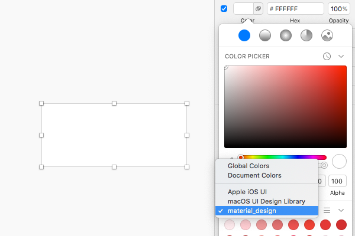

Sketch 没有类似 Photoshop 的 swatches 色板资源管理功能，可以使用 "View" - "Show Colors" 调出系统的色彩管理器来管理色板，但其仅支持 macOS 特定的 .clr 格式文件，很难将已有的色板文件转为此格式。我做过一个名为 [Swatches](https://github.com/Ashung/Sketch_Swatches) 的 Sketch 色板插件，目的只是为了显示一些商业色板、平台色板和设计系统色板，所以没做用户自定义色板。

在 Sketch 53 之后可以利用色彩预设可以显示库中色彩的功能，达到类似于 swatches 功能。之前因为 Swatches 插件包含商业色板收到警告而删除内容，导致插件少了很多内容，所以决定停止维护，而转向开发 [Import Colors](https://github.com/Ashung/import-colors-sketch)，利用插件增强 Sketch 对各种色板文件的支持，让 Sketch 可以导入 Photoshop、Illustrator 等软件中附带的商业色板。

## 色板导入

### 导入色板文件

目前 Import Color 支持将以下格式导入到 Sketch 的文档或全局色板，甚至作为单纯的色彩库。

| 名称                        | 文件后缀          | 支持软件                |
| -------------------------- | ---------------- | ---------------------- |
| Apple Color Picker Palette | `.clr`           | macOS 取色器           |
| Adobe Color Swatch         | `.aco`           | Photoshop              |
| Adobe Swatch Exchange      | `.ase`           | Photoshop, Illustrator |
| GIMP 色板                  | `.gpl`           | GIMP, Inkscape         |
| Sketch 色板                | `.sketchpalette` | 旧版 Sketch            |
| Sketch 预设                | `.sketchpreset`  | Sketch                 |
| Sketch 文档                | `.sketch`        | Sketch                 |
| 文本文件                    | `.txt`, `.text`  | 任何文本编辑器          |

可以在网上找到很多 .aco 或 .ase 格式的 Photoshop 色板文件，甚至在 Photoshop 的安装目录中也能找到附带的商业色板。.aco 或 .ase 格式中保存为 CMYK, LAB, 灰度模式的色彩，转换到 Sketch 中 RGB 模式可能会与 Photoshop 中的 RGB 模式色值上有轻微偏差。

### 库色板



如果当前可用的库中包含色板资源，就会在取色器弹出层下方的菜单中出现，这个功能可用当作类似 Photoshop 的 swatches 色板资源管理来使用。Import Colors 可以将色板生成一个只有色彩资源的库文件，也可以在打开库文件时，将色板导入到库的文档中。

## 共享色板

Import Colors 可以将支持的格式或文档色板转为 .txt 或 .clr 文件，Import Colors 定义了一种方便编辑和共享的纯文本格式用来保存色板，每个色彩以 `name: value` 的格式，以每行记录一个色彩的方式保存为 .txt 文件，色彩值目前支持所有的 CSS 色值。

格式如下：

```
Red 50: #FFEBEE
Red 100: #FFCDD2
Red 200: #EF9A9A
Red 300: #E57373
```

