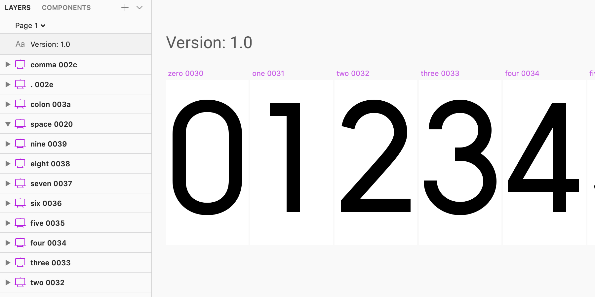
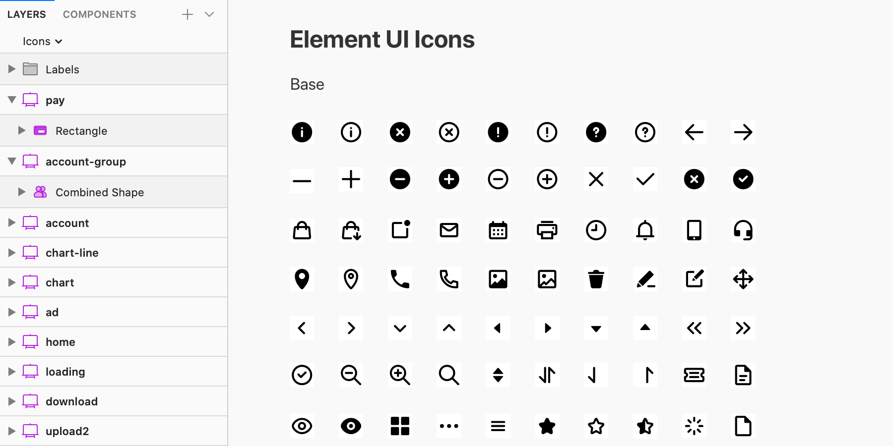
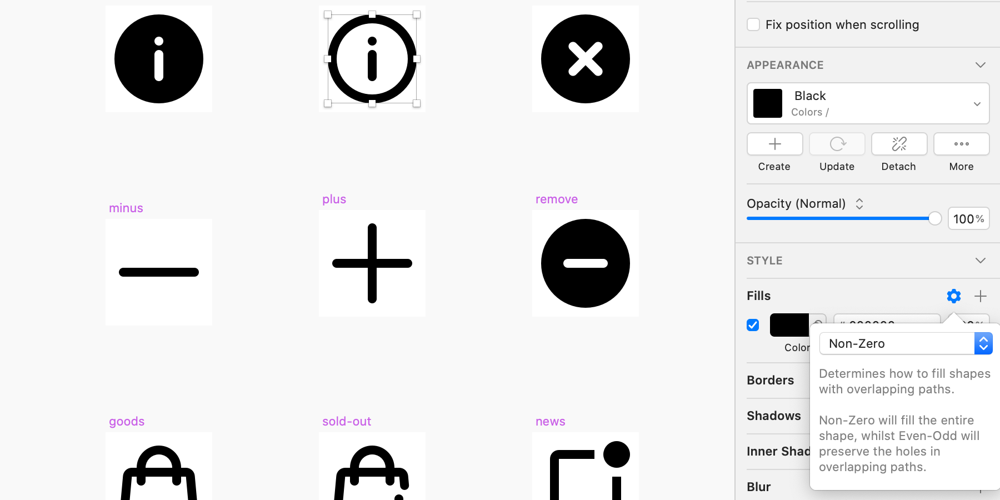

目前国内设计师生成图标字体的方法，通常是在设计软件中导出 SVG，再将其上传至 iconfont.cn 网站上，由网站提供的服务生成一套各种格式的字体以及使用文档。这个方式虽然操作简单，但管理太大图标时并不高效，还有无法将图标指定具体某个 unicode，无法修改字体的参数设置，导致该工具并不能用于生成简单的数字、字母或特殊字符等字体。若用 Glyphs 此类的专业字体软件，设计师则需要额外学习很多软件操作和字体知识。在前端开发中使用的一些字体生成工具，对于设计师来说则过于复杂。

这篇文章中将介绍一种使用 [opentype.js](https://opentype.js.org/) 来创建可以直接从 Sketch 中导出 OpenType (.otf) 格式字体的插件，适用于图标及简单的数字、字母或特殊字符等字体。插件中并未考虑例如连体等高级功能，仅是将 Sketch 中的元素转为字体文件中的字形。

相较于 iconfont.cn 网站，这种方式可以不需要离开 Sketch，不需要导出 SVG 文件，用来设计图标或字体的 Sketch 文件可以直接被当作库分享给其他设计师。然而目前插件只提供 OpenType (.otf) 一种格式，目前此中格式可以被网页端、Android 和 iOS 等平台支持，如果需要其他格式可以使用类似 [convertio.co](https://convertio.co/zh/font-converter/) 之类的在线转换工具。

## 工程化思考

设计师在开始进入某个项目的工作之前，应该对比不同实施方案带来的协作和维护成本，思考整个项目该如何管理，如何协作，是否需要引入某些流程自动化工具，以及后期如何交付和维护。特别是大型的图标字体，并且可能还会将图标生成其他平台的特定格式，这种工程化的思考就很重要，可以带来很多的效率提高。

整个项目使用如下的目录结构。

```
|- dist/
|- script/
	|- main.js
	|- mainfest.json
	|- opentype.js
|- sketch/
|- README.md
|- install.sh
```

“sketch” 目录保存 Sketch 源文件；“script” 目录是用来保存导出字体的代码，这个结构并非严格意义上的 Sketch 插件，而是以脚本文件形式附在项目中，这样可以更加定制化，不必考虑插件的通用性；通过运行 “install.sh” 创建一个 Sketch 插件，让导出字体功能出现在 Sketch 插件菜单上，但仍映射到 “script” 目录下的文件，所以每次执行插件都是运行修改之后的最新代码；“dist” 目录则用来保存最终导出的字体文件。整个项目用到的工具，甚至 Sketch 文件的图册结构都比较特殊，有必要将所有的操作细节文档化，方法协作和交付，“README.md” 就起到这个作用。

## 源文件规范



### 命名规范

规定好的 Sketch 文档结构，可以更方便脚本获取到字体所需要的数据，这里将所有字符或图标都是一个组件，是因为考虑到文件可以被用做库，在其他文件中引用。在如图的数字字体中组件画板的高宽即为字符的高宽，不一定要像字体软件那样把高都定为 1ooo 或 1024 等等，过大的尺寸会给设计过程带来很多不便，图标字体也是这样，按照常规的 16x16 或 24x24 即可，然后通过脚本来处理这个问题。

为了版本迭代，增加一个文本图层来记录版本号，文字内容格式为 “Version: 1.0”，脚本会处理这个文本图册，把版本信息写入字体。字体的版本号有严格的要求，它看起来更像真实的小数，例如 1.0、1.001，而不能像某些软件那样使用 1.0.1、1.0.001。

将 Sketch 文件的文件名作为字体的名称，字重或样式也写在文件名上，例如 “Myfont_Regular.sketch” 、“Myfont_Light.sketch”。图标字体可以直接用图标的名称，例如 “Myicon.sketch”。最后字体需要的其他信息都写入在脚本中。

设计文字字体时需要在组件的名称上标记字符的 Unicode 编码，如上图将字符的名称和编码用空格隔开。图标则可以在脚本中按顺序分配编码，也可强行指定。

### 图层规范



在设计文字和图标字体时，都需要将内容的图层合并一个图层，图中给图标加图层样式，不仅是出于库使用时的考虑。一个重要的问题是，由于要将 Sketch 中的路径准确转为字体中字形的路径时，需要将 Sketch 中的图层填充设置为 Non-Zero。而刚好这个设置也保护在样式中，所以通过为图层添加样式的操作，会比给每个图层单独设置，来得更方便。至于图层上是否包含样式和使用何种颜色填充，都与字体生成无关，字体只需要路径的数据，所以另一个问题是要将描边扩展转为填充。



目前在 Sketch 上没有自动检测是否符合某些规范的插件，为了保证最终字体输出无误，需要人工仔细检验是否符合这些规定。

## 字体生成

### 下载 opentype.js

字体生成使用 [opentype.js](https://opentype.js.org/) 库，从 https://github.com/opentypejs/opentype.js/blob/master/dist 下载 opentype.js，保存到 “script/opentype.js”。

### 插件安装

创建 “script/mainfest.json”，这是 Sketch 插件必不可少的清单文件，将会在 Sketch 的 Plugins 菜单下增加一个名为 “Export Font” 的菜单，内容如下。

```json
{
  "commands": [
    {
      "name": "Export Font",
      "identifier": "export-font",
      "script": "main.js"
    }
  ],
  "menu": {
    "title": "Export Font",
    "isRoot": true,
    "items": ["export-font"]
  },
  "identifier" : "com.xxx.export-opentype-font",
  "version" : "1.0",
  "description" : "Export opentype font from Sketch.",
  "author": "...",
  "name" : "Export Font"
}
```

创建 “script/main.js” ，这是 Sketch 插件主文件，临时写一段验证是否安装成功的示例代码，它会在 Sketch 底部弹出一段 “Hello Sketch” 信息。

```javascript
var onRun = function(context) {
    var sketch = require("sketch");
    sketch.UI.message("Hello Sketch");
};
```

创建 “install.sh” 用来将 script 目录下的文件打包成 Sketch 插件。

```bash
#!/usr/bin/env bash

pluginFolder="/Users/$(whoami)/Library/Application Support/com.bohemiancoding.sketch3/Plugins/create-opentype-font.sketchplugin"

if [ -d "${pluginFolder}" ]; then
    rm -rf "${pluginFolder}"
fi

projectPath="`dirname \"$0\"`" 
projectPath="`( cd \"${projectPath}\" && pwd )`"  # absolutized and normalized
if [ -z "${projectPath}" ]; then
  exit 1
fi

mkdir -p "${pluginFolder}/Contents"
ln -s "${projectPath}/script" "${pluginFolder}/Contents/Sketch"
ln -s "${projectPath}/dist" "${pluginFolder}/Contents/Resources"
```

打开 “终端” 应用，输入 `sh ` （带有空格），然后将 “install.sh” 拖到窗口上，按回车运行代码。运行成功会在 Sketch 的 Plugins 菜单下找到 “Export Font” 菜单项。运行 “Export Font” 将会看到 “Hello Sketch” 提示信息。

### 编写字体生成代码

打开 “script/main.js” 删除原本的测试代码，开始编写字体生成代码。

```javascript
var onRun = function(context) {
    var opentype = require("./opentype");
    var sketch = require("sketch");
    var util = require("util");
    var path = require("path");
    var document = sketch.getSelectedDocument();
};
```

查找为记录版本号增加的格式为 “Version: 1.0” 的文本图层，然后将其内容专为字体版本号，默认版本号为 “1.000”。

```javascript
var onRun = function(context) {
    // 以上省略...
    // Font Version
    var version = "1.000";
    document.pages.forEach(function(page) {
        var _version = page.layers.filter(function(layer) {
            return layer.type == "Text"
        }).map(function(layer) {
            return layer.text;
        }).find(function(text) {
            return /Version:/i.test(text)
        });
        if (_version) {
            _version = parseFloat(_version.replace(/Version:\s?/i, ""))
        }
        if (!Number.isNaN(Number(_version))) {
            version = _version.toFixed(3).toString();
        }
    });
};
```

从当前文档名获取字体名称和样式。

```javascript
var onRun = function(context) {
    // 以上省略...
    // Font info
    var fontName = path.basename(document.path, ".sketch");
    var familyName = fontName.split("_")[0];
    var styleName = fontName.split("_")[1] || "Regular";
    var unitsPerEm = 1000;
    var ascender = 800;
    var descender = -200;
};
```

获取当前文档内的所有本地组件，组件名作为字符名称，如果组件名指定了 Unicode 编码，则将其作为字符编码。如果是图标字体没有指定编码则从 Unicode 私人使用区 U+E000–U+F8FF（6400个码位）按顺序指定给图标。接着解析组件内图形的路径信息，转为字符所需要的路径信息，Sketch 的路径数值是一个非常多位的小数，在字体中并不需要那么精确，这里把所有数值都保留 6 位精度。

```javascript
var onRun = function(context) {
    // 以上省略...
    // Glyphs
    var glyphs = [];
    var notdefGlyph = new opentype.Glyph({
        name: ".notdef",
        unicode: 0,
        advanceWidth: unitsPerEm,
        path: new opentype.Path()
    });
    glyphs.push(notdefGlyph);
    // Get all local symbols
    var symbols = util.toArray(document._getMSDocumentData().localSymbols());
    // Private Use Areas U+E000
    var pua = 57344;
    symbols.forEach(function(symbol, index) {
        var [name, unicode] = symbol.name().split(/\s+/);
        if (unicode) {
            unicode = Number("0x" + unicode);
        } else {
            unicode = pua;
            pua ++;
        }
        var scale = unitsPerEm / symbol.frame().height();
        var advanceWidth = parseInt(symbol.frame().width() * scale);
        // Path
        var _path = new opentype.Path();
        if (symbol.pathInBounds()) {
            util.toArray(symbol.pathInBounds().contours()).forEach(function(bezierContour) {
                util.toArray(bezierContour.segments()).forEach(function(point, index) {
                    if (index == 0) {
                        _path.moveTo(
                            f(point.endPoint1().x * scale),
                            f(ascender - point.endPoint1().y * scale)
                        );
                    }
                    if (point.segmentType() == 0) {
                        _path.lineTo(
                            f(point.endPoint2().x * scale),
                            f(ascender - point.endPoint2().y * scale)
                        );
                    }
                    if (point.segmentType() == 2) {
                        _path.curveTo(
                            f(point.controlPoint1().x * scale),
                            f(ascender - point.controlPoint1().y * scale),
                            f(point.controlPoint2().x * scale),
                            f(ascender - point.controlPoint2().y * scale),
                            f(point.endPoint2().x * scale),
                            f(ascender - point.endPoint2().y * scale)
                        )
                    }
                });
                if (bezierContour.isClosed()) {
                    _path.close();
                }
            });
        }
        // Glyph
        var _glyph = new opentype.Glyph({
            name: name,
            unicode: unicode,
            advanceWidth: advanceWidth,
            path: _path
        });
        glyphs.push(_glyph);
    });
};

function f(n) {
    return parseFloat(Number(n).toFixed(6));
}
```

创建字体对象。

```javascript
var onRun = function(context) {
    // 以上省略...
    // Font
    var font = new opentype.Font({
        familyName: familyName,
        styleName: styleName,
        unitsPerEm: unitsPerEm,
        ascender: ascender,
        descender: descender,
        version: "Version: " + version,
        glyphs: glyphs
    });
};
```

opentype.js 可以直接用在在浏览器和 node.js 环境下，但将其用在 Sketch 环境中，需要重写一个用于保存字体文件的方法 `exportFont`。完成脚本之后，运行 Sketch 的 Plugins 菜单下的 “Export Font”，字体文件自动保存到 “dist” 目录下。

```javascript
var onRun = function(context) {
    // 以上省略...
    // Export
    var filePath = __command.pluginBundle().url().path() + "/Contents/Resources/" + fontName + ".otf";
    exportFont(font, filePath);
    sketch.UI.message(fontName + '.otf export done.');
};

// 省略 function f(n) {...}

function exportFont(font, filePath) {
    var arrayBuffer = font.toArrayBuffer();
    var buffer = new Buffer(arrayBuffer.byteLength);
    var view = new Uint8Array(arrayBuffer);
    for (var i = 0; i < buffer.length; ++i) {
        buffer[i] = view[i];
    }
    var nsData = buffer.toNSData();
    nsData.writeToFile_atomically(filePath, true);
}
```

## 字体预览

通过网页的 Web Font 来做字体预览是比较方便的方式，不需要反复安装字体。

```html
<!doctype html>
<html>
<head>
<meta charset="utf-8">
<title>Font Preview</title>
<style>
@font-face {
    font-family: "MyFont";
    font-weight: 400;
    src: url("./dist/MyFont_Regular.otf") format("opentype");
}
body {
    font-size: 48px;
    font-family: MyFont, sans-serif;
}
</style>
</head>
<body>
0123456789
</body>
</html>
```

图标字体则将 body 内的内容改用 javascript 生成字符。

```html
<body>
<script>
const start = Number('0x' + 'E000');
for (let i = 0; i < 200; i++) {
    const text = document.createElement('span');
    text.innerHTML = `&#x${(i + start).toString(16)}; `;
    document.body.appendChild(text);
}
</script>
</body>
```

